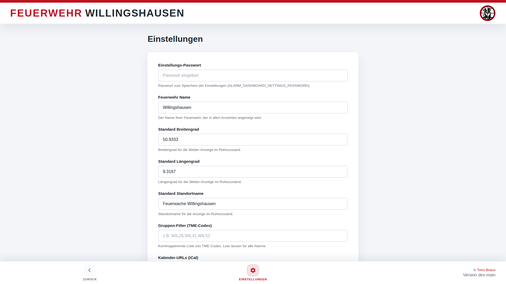

# 🚒 Feuerwehr Alarm Monitor

> Webbasiertes Dashboard zur automatischen Verarbeitung und Darstellung von Feuerwehr-Alarmen mit Echtzeit-Anzeige, Kartendarstellung und Wetterinformationen.

[](https://opensource.org/licenses/MIT)
[](https://www.python.org/downloads/)
[](https://www.docker.com/)

---

## 📋 Inhaltsverzeichnis

- [Überblick](#überblick)
- [Features](#features)
- [Screenshots](#screenshots)
- [Systemarchitektur](#systemarchitektur)
- [Schnellstart](#schnellstart)
- [Installation](#installation)
- [Konfiguration](#konfiguration)
- [Verwendung](#verwendung)
- [Integration mit alarm-mail und alarm-messenger](#integration)
- [Dokumentation](#dokumentation)
- [Entwicklung](#entwicklung)
- [Lizenz](#lizenz)

---

## 🎯 Überblick

Der **Feuerwehr Alarm Monitor** ist ein modernes, webbasiertes Dashboard-System zur automatischen Verarbeitung und Darstellung von Alarm-Meldungen. Das System wurde speziell für Feuerwehren entwickelt und eignet sich für Installationen im lokalen Netzwerk, bei denen ein Server-Gerät die Alarmverarbeitung übernimmt und mehrere Client-Geräte die Informationen in verschiedenen Ansichten darstellen.

### Einsatzszenarien

- **Wachenzentrale**: Großbildschirm im Vollbildmodus (Kiosk-Modus)
- **Fahrzeughalle**: Zusätzliche Displays für schnelle Informationen
- **Mobile Endgeräte**: Smartphone-optimierte Ansicht mit Navigationsfunktion
- **Einsatzleitung**: Desktop-Ansicht mit Historie und Detailinformationen

### Systemkomponenten

Das System besteht aus drei entkoppelten Komponenten, die zusammen eine vollständige Alarm-Management-Lösung bilden:

1. **[alarm-mail](https://github.com/TimUx/alarm-mail)** – E-Mail-Überwachung und Parsing
2. **alarm-monitor** (dieses Repository) – Dashboard und Datenverarbeitung
3. **[alarm-messenger](https://github.com/TimUx/alarm-messenger)** (optional) – Mobile Push-Benachrichtigungen und Rückmeldungen

---

## ✨ Features

### Alarmverarbeitung
- ✅ **API-basierter Empfang** – Authentifizierte REST-API für sichere Alarmübermittlung
- ✅ **Duplikatserkennung** – Automatische Erkennung bereits verarbeiteter Alarme
- ✅ **Gruppenfilterung** – Optionale Filterung nach TME-Codes oder Gruppennamen
- ✅ **Persistente Speicherung** – Alle Alarme werden in einer Historie gespeichert

### Geodaten & Kartendarstellung
- 🗺️ **Automatische Geokodierung** – Koordinaten-Ermittlung über OpenStreetMap (Nominatim)
- 🗺️ **Interaktive Karte** – Einsatzort-Darstellung mit Leaflet und OpenStreetMap
- 🗺️ **Navigation** – Dedizierte Navigationsseite mit Routenplanung (optional mit OpenRouteService)
- 🗺️ **Mobile Navigation** – Direkte Links zu Apple Karten / Google Maps

### Wetter & Umgebungsinformationen
- 🌤️ **Aktuelle Wetterdaten** – Temperatur, Niederschlag, Wind über Open-Meteo API
- 🌤️ **Wettervorhersage** – Stündliche Vorhersage für Einsatzplanung
- 🌤️ **Standort-Wetter** – Wetterdaten für Einsatzort in Alarmansicht
- 🌤️ **Idle-Wetter** – Lokales Wetter in der Standardansicht

### Dashboard-Ansichten
- 📺 **Alarm-Ansicht** – Vollbildanzeige mit allen Einsatzinformationen
- 📺 **Idle-Ansicht** – Uhrzeit, Wetter und letzter Einsatz im Ruhezustand
- 📺 **Mobile-Ansicht** – Optimiert für Smartphones und Tablets
- 📺 **Historien-Ansicht** – Tabellarische Übersicht aller vergangenen Einsätze
- 📺 **Navigations-Ansicht** – Routenplanung zum Einsatzort

### Messenger-Integration (optional)
- 📱 **Push-Benachrichtigungen** – Mobile Alarmierung über alarm-messenger
- 📱 **Teilnehmerrückmeldungen** – Echtzeit-Anzeige von Zusagen/Absagen
- 📱 **Qualifikationen** – Anzeige von Qualifikationen der Teilnehmer
- 📱 **Führungsrollen** – Kennzeichnung von Führungskräften

### Anpassbarkeit
- 🎨 **Branding** – Anpassbare Feuerwehrnamen und Logos
- 🎨 **Farbschema** – CSS-Variablen für individuelle Farbgestaltung
- 🎨 **Anzeigedauer** – Konfigurierbare Dauer der Alarmanzeige
- 🎨 **Standortdaten** – Individuelle Standardkoordinaten und Standortnamen

### Web-basierte Einstellungen
- ⚙️ **Einstellungs-Oberfläche** – Webbasierte Konfiguration ohne Neustart
- ⚙️ **Feuerwehr-Name** – Dynamische Anpassung des angezeigten Namens
- ⚙️ **Standortkonfiguration** – Einstellung von Standardkoordinaten und Standortnamen
- ⚙️ **Gruppenfilter** – Konfiguration der TME-Codes direkt in der Oberfläche
- ⚙️ **Persistente Speicherung** – Einstellungen bleiben über Neustarts hinweg erhalten

---

## 📸 Screenshots

### Dashboard – Alarmansicht
Bei einem aktiven Einsatz zeigt das Dashboard alle relevanten Informationen wie Stichwort, Einsatzort, alarmierte Fahrzeuge und Wetterdaten an.


### Dashboard – Teilnehmerrückmeldungen
Bei aktivierter alarm-messenger Integration zeigt das Dashboard die Rückmeldungen der Einsatzkräfte in Echtzeit an.


### Dashboard – Standardansicht (Idle)
Im Ruhezustand zeigt das Dashboard Uhrzeit, Datum, aktuelles Wetter und den letzten Einsatz.


### Einsatzhistorie
Übersichtliche Darstellung aller vergangenen Einsätze mit Filterfunktion.


### Mobile Ansicht
Optimiert für Smartphones und Tablets mit Touch-Bedienung und direkter Navigation.


### Einstellungen
Webbasierte Konfigurationsoberfläche für zentrale Einstellungen wie Feuerwehr-Name, Standort und Gruppenfilter. Änderungen werden sofort übernommen und persistent gespeichert.



---

## 🏗️ Systemarchitektur

```
┌─────────────────────┐
│  IMAP Postfach      │  ← Leitstelle sendet Alarm-E-Mails
│  (Leitstelle)       │
└──────────┬──────────┘
           │
           │ E-Mails mit XML-Inhalt
           ↓
┌─────────────────────┐
│  alarm-mail         │  ← Überwacht Postfach, parst E-Mails
│  Service            │     (separater Microservice)
└──────────┬──────────┘
           │
           ├──────────────────────┬─────────────────────┐
           │                      │                     │
           │ POST /api/alarm      │ POST /api/emergencies (optional)
           ↓                      ↓                     ↓
┌─────────────────────┐    ┌──────────────────┐   ┌─────────────────────┐
│  alarm-monitor      │    │  alarm-messenger │   │  Browser Clients    │
│  (Dashboard)        │◄───│  (optional)      │   │  - Desktop          │
│                     │    │                  │   │  - Mobile           │
│  - Empfängt Alarme  │    │  - Push-Benachri-│   │  - Tablets          │
│  - Geokodierung     │    │    chtigungen    │   │  - Kiosk-Displays   │
│  - Wetterabfrage    │    │  - Teilnehmer-   │   └─────────────────────┘
│  - Speicherung      │    │    rückmeldungen │            │
│  - Dashboard-API    │    └──────────────────┘            │
└──────────┬──────────┘                                    │
           │                                               │
           │ GET /api/emergencies/{id}/participants        │
           │ (Teilnehmerrückmeldungen abrufen)            │
           │                                               │
           └───────────────────────────────────────────────┘
                    HTTP/HTTPS (Web-Interface)
```

### Datenfluss

1. **E-Mail-Empfang**: Die Leitstelle sendet Alarm-E-Mails mit XML-Inhalt an ein IMAP-Postfach
2. **Parsing**: Der `alarm-mail` Service prüft regelmäßig das Postfach, parst die E-Mails und extrahiert die Alarmdaten
3. **Übermittlung**: Alarme werden via REST-API an `alarm-monitor` gesendet (und optional an `alarm-messenger`)
4. **Verarbeitung**: Der `alarm-monitor` reichert Alarme mit Geodaten und Wetterdaten an
5. **Speicherung**: Alarme werden persistent in der Historie gespeichert
6. **Darstellung**: Browser-Clients zeigen Alarme in verschiedenen Ansichten an
7. **Rückmeldung** (optional): `alarm-messenger` sendet Push-Benachrichtigungen und sammelt Teilnehmerrückmeldungen

### Komponenten-Details

#### alarm-mail Service (separat)
- **Funktion**: IMAP-Postfach-Überwachung und E-Mail-Parsing
- **Repository**: [github.com/TimUx/alarm-mail](https://github.com/TimUx/alarm-mail)
- **Technologie**: Python, IMAP, XML-Parsing
- **Aufgaben**:
  - Regelmäßige Prüfung des IMAP-Postfachs
  - Parsing von XML-Alarm-Daten
  - Validierung und Transformation
  - REST-API Übermittlung an alarm-monitor

#### alarm-monitor (dieses Repository)
- **Funktion**: Zentrale Dashboard-Anwendung
- **Technologie**: Python, Flask, SQLite/JSON
- **Aufgaben**:
  - Empfang von Alarmen über REST-API
  - Geokodierung über Nominatim
  - Wetterabfrage über Open-Meteo
  - Persistente Speicherung
  - Web-Dashboard mit mehreren Ansichten
  - API für externe Clients

#### alarm-messenger (optional)
- **Funktion**: Mobile Push-Benachrichtigungen und Teilnehmerverwaltung
- **Repository**: [github.com/TimUx/alarm-messenger](https://github.com/TimUx/alarm-messenger)
- **Technologie**: Node.js, Express, Push-Notifications
- **Aufgaben**:
  - Empfang von Alarmen vom alarm-mail Service
  - Versand von Push-Benachrichtigungen an registrierte Geräte
  - Sammlung von Teilnehmerrückmeldungen
  - Bereitstellung von Rückmeldedaten für alarm-monitor

---

## 🚀 Schnellstart

### Voraussetzungen

- Docker und Docker Compose installiert **ODER**
- Python 3.9+ für native Installation
- Netzwerkverbindung zu OpenStreetMap und Open-Meteo
- Zugriff auf IMAP-Postfach (für alarm-mail Service)

### In 5 Minuten einsatzbereit

```bash
# 1. Repository klonen
git clone https://github.com/TimUx/alarm-monitor.git
cd alarm-monitor

# 2. Konfiguration erstellen
cp .env.example .env
nano .env  # API-Key eintragen: openssl rand -hex 32

# 3. Container starten
docker compose up -d

# 4. Dashboard öffnen
# Browser: http://localhost:8000
```

**Fertig!** Das Dashboard läuft jetzt und wartet auf Alarme vom alarm-mail Service.

### Nächste Schritte

1. **alarm-mail Service einrichten** – Siehe [Integration mit alarm-mail](#integration-mit-alarm-mail)
2. **Konfiguration anpassen** – Siehe [Konfiguration](#konfiguration)
3. **alarm-messenger einrichten** (optional) – Siehe [Integration mit alarm-messenger](#integration-mit-alarm-messenger)

---

## 📦 Installation

### Option 1: Docker (empfohlen)

Docker ist die einfachste und empfohlene Methode für Produktion.

```bash
# Voraussetzungen installieren
sudo apt update
sudo apt install docker.io docker-compose -y

# Repository klonen
git clone https://github.com/TimUx/alarm-monitor.git
cd alarm-monitor

# Konfiguration erstellen
cp .env.example .env

# API-Key generieren und eintragen
openssl rand -hex 32  # Kopieren Sie den Output
nano .env             # Tragen Sie den API-Key ein

# Container bauen und starten
docker compose up --build -d

# Status prüfen
docker compose ps
docker compose logs -f

# Health-Check
curl http://localhost:8000/health
```

**Hinweis**: Die Datei `instance/alarm_history.json` wird automatisch gemountet und bleibt bei Container-Updates erhalten.

### Option 2: Native Python-Installation

Für Entwicklung oder wenn Docker nicht verfügbar ist.

```bash
# System vorbereiten
sudo apt update
sudo apt install python3 python3-venv python3-pip git -y

# Repository klonen
git clone https://github.com/TimUx/alarm-monitor.git
cd alarm-monitor

# Virtuelle Umgebung erstellen
python3 -m venv .venv
source .venv/bin/activate

# Abhängigkeiten installieren
pip install --upgrade pip
pip install -r requirements.txt

# Konfiguration
cp .env.example .env
openssl rand -hex 32  # API-Key generieren
nano .env             # Konfiguration anpassen

# Anwendung starten
flask --app alarm_dashboard.app run --host 0.0.0.0 --port 8000

# Oder mit Gunicorn für Produktion
gunicorn --bind 0.0.0.0:8000 --workers 2 'alarm_dashboard.app:create_app()'
```

### Systemd-Service (Autostart)

Für native Installation mit automatischem Start:

```bash
sudo nano /etc/systemd/system/alarm-monitor.service
```

```ini
[Unit]
Description=Feuerwehr Alarm Monitor
After=network.target

[Service]
Type=simple
User=pi
WorkingDirectory=/home/pi/alarm-monitor
Environment="PATH=/home/pi/alarm-monitor/.venv/bin"
ExecStart=/home/pi/alarm-monitor/.venv/bin/gunicorn \
    --bind 0.0.0.0:8000 \
    --workers 2 \
    --worker-class gthread \
    --threads 4 \
    'alarm_dashboard.app:create_app()'
Restart=always
RestartSec=10

[Install]
WantedBy=multi-user.target
```

```bash
sudo systemctl daemon-reload
sudo systemctl enable alarm-monitor
sudo systemctl start alarm-monitor
sudo systemctl status alarm-monitor
```

### Raspberry Pi Kiosk-Modus

Für dedizierte Anzeigegeräte im Vollbildmodus:

```bash
# Autostart-Skript erstellen
mkdir -p ~/.config/autostart

cat > ~/.config/autostart/alarm-dashboard.desktop << 'EOF'
[Desktop Entry]
Type=Application
Name=Alarm Dashboard Kiosk
Exec=chromium-browser --kiosk --noerrdialogs --disable-infobars --disable-session-crashed-bubble http://SERVER-IP:8000
EOF

# Bildschirmschoner deaktivieren
sudo nano /etc/xdg/lxsession/LXDE-pi/autostart
# Folgende Zeilen hinzufügen:
# @xset s off
# @xset -dpms
# @xset s noblank
```

---

## ⚙️ Konfiguration

Die Konfiguration erfolgt über zwei Wege:

1. **Web-Oberfläche (empfohlen)**: Zentrale Einstellungen können direkt in der Web-Oberfläche unter `/settings` konfiguriert werden
2. **Umgebungsvariablen**: Als Fallback für initiale Konfiguration oder wenn keine Web-UI verfügbar ist

### Web-basierte Einstellungen

Folgende Einstellungen können direkt über die Web-Oberfläche konfiguriert werden (erreichbar über den Einstellungen-Button im Menü):

- **Feuerwehr-Name**: Name der Feuerwehr, der in allen Ansichten angezeigt wird
- **Standard Breitengrad/Längengrad**: Koordinaten für Wetter-Anzeige im Ruhezustand
- **Standard Standortname**: Bezeichnung des Standorts (z.B. "Feuerwache Willingshausen")
- **Gruppen-Filter (TME-Codes)**: Kommagetrennte Liste von TME-Codes zur Alarmfilterung

**Hinweis**: Web-basierte Einstellungen haben Vorrang vor Umgebungsvariablen und werden persistent gespeichert.

### Pflichtparameter

```bash
# API-Key für Alarmempfang (ERFORDERLICH)
# Generieren mit: openssl rand -hex 32
ALARM_DASHBOARD_API_KEY=a1b2c3d4e5f6g7h8i9j0k1l2m3n4o5p6
```

**Wichtig**: Dieser API-Key muss im `alarm-mail` Service als `ALARM_MAIL_MONITOR_API_KEY` konfiguriert werden.

### Grundeinstellungen (optional, können auch über Web-UI gesetzt werden)

```bash
# Feuerwehr-Name für Anzeige (kann in Web-UI geändert werden)
# ALARM_DASHBOARD_FIRE_DEPARTMENT_NAME=Feuerwehr Musterstadt

# Anzeigedauer eines Alarms in Minuten (danach Wechsel zu Idle-Ansicht)
ALARM_DASHBOARD_DISPLAY_DURATION_MINUTES=30

# Standardkoordinaten für Idle-Ansicht (können in Web-UI geändert werden)
# ALARM_DASHBOARD_DEFAULT_LATITUDE=51.2345
# ALARM_DASHBOARD_DEFAULT_LONGITUDE=9.8765
# ALARM_DASHBOARD_DEFAULT_LOCATION_NAME=Feuerwache Musterstadt
```

### Gruppenfilterung (kann in Web-UI konfiguriert werden)

```bash
# Kommagetrennte Liste von TME-Codes für Alarmfilterung (kann in Web-UI geändert werden)
# Leer = alle Alarme werden angezeigt
# Mit Werten = nur Alarme mit diesen TME-Codes werden angezeigt
# ALARM_DASHBOARD_GRUPPEN=WIL26,WIL41,WIL52
```

### Externe Dienste (optional)

```bash
# Nominatim für Geokodierung (Standard: OSM)
# ALARM_DASHBOARD_NOMINATIM_URL=https://nominatim.openstreetmap.org/search

# Open-Meteo für Wetter (Standard: Open-Meteo API)
# ALARM_DASHBOARD_WEATHER_URL=https://api.open-meteo.com/v1/forecast
# ALARM_DASHBOARD_WEATHER_PARAMS=current_weather=true&hourly=precipitation,precipitation_probability

# OpenRouteService für Navigation (optional)
# ALARM_DASHBOARD_ORS_API_KEY=your-ors-api-key-here
```

### alarm-messenger Integration (optional)

```bash
# Messenger-Server URL und API-Key
ALARM_DASHBOARD_MESSENGER_SERVER_URL=https://messenger.example.com
ALARM_DASHBOARD_MESSENGER_API_KEY=your-messenger-api-key-here
```

**Hinweis**: Ohne diese Konfiguration funktioniert das System vollständig, zeigt aber keine Teilnehmerrückmeldungen an.

### Erweiterte Einstellungen

```bash
# Pfad zur Historie-Datei (Standard: instance/alarm_history.json)
# ALARM_DASHBOARD_HISTORY_FILE=/custom/path/to/history.json

# Version und Release-Link
# ALARM_DASHBOARD_APP_VERSION=v1.0.0
# ALARM_DASHBOARD_APP_VERSION_URL=https://github.com/TimUx/alarm-monitor/releases/tag/v1.0.0
```

### Vollständiges Konfigurationsbeispiel

```bash
# ==============================================
# Feuerwehr Alarm Monitor - Konfiguration
# ==============================================

# --- PFLICHTFELDER ---
ALARM_DASHBOARD_API_KEY=a1b2c3d4e5f6g7h8i9j0k1l2m3n4o5p6

# --- GRUNDEINSTELLUNGEN ---
ALARM_DASHBOARD_FIRE_DEPARTMENT_NAME=Feuerwehr Willingshausen
ALARM_DASHBOARD_DISPLAY_DURATION_MINUTES=30
ALARM_DASHBOARD_DEFAULT_LATITUDE=50.9345
ALARM_DASHBOARD_DEFAULT_LONGITUDE=9.2834
ALARM_DASHBOARD_DEFAULT_LOCATION_NAME=Feuerwehrhaus Willingshausen

# --- GRUPPENFILTER ---
# Leer = alle Alarme, oder TME-Codes kommagetrennt
ALARM_DASHBOARD_GRUPPEN=

# --- MESSENGER-INTEGRATION (optional) ---
# Für Teilnehmerrückmeldungen und Push-Benachrichtigungen
# ALARM_DASHBOARD_MESSENGER_SERVER_URL=https://messenger.feuerwehr-beispiel.de
# ALARM_DASHBOARD_MESSENGER_API_KEY=messenger-api-key-hier

# --- NAVIGATION (optional) ---
# OpenRouteService API-Key für Routenplanung
# ALARM_DASHBOARD_ORS_API_KEY=ors-api-key-hier

# --- VERSION ---
ALARM_DASHBOARD_APP_VERSION=v1.0.0
```

---

## 🔧 Verwendung

### Dashboard-Ansichten

#### Haupt-Dashboard (`/`)
Das Hauptdashboard zeigt entweder den aktuellen Alarm oder die Idle-Ansicht an.

**Alarmansicht** (bei aktivem Alarm):
- Einsatzstichwort und Unterstichwort
- Zeitstempel des Alarms
- Interaktive Karte mit Einsatzort
- Vollständige Adressinformationen
- Aktuelle Wetterdaten am Einsatzort
- Diagnose und Bemerkungen
- Alarmierte Fahrzeuge (AAO)
- Funkmeldeempfänger (FME)
- Telefonmeldeempfänger (TME)
- Teilnehmerrückmeldungen (wenn alarm-messenger aktiv)

**Idle-Ansicht** (kein aktiver Alarm):
- Große Uhr mit Datum
- Lokales Wetter am Standort
- Vereinswappen
- Kompakte Anzeige des letzten Einsatzes

#### Mobile-Ansicht (`/mobile`)
Optimiert für Smartphones und Tablets:
- Touch-freundliche Bedienung
- Kompakte Informationsdarstellung
- Direkte Navigation zu Apple Karten / Google Maps
- Automatische Aktualisierung

#### Historien-Ansicht (`/history`)
Tabellarische Übersicht aller Einsätze:
- Chronologische Sortierung (neueste zuerst)
- Zeitstempel, Stichwort, Ort
- Diagnose und Bemerkungen
- Alarmierte Fahrzeuge
- Filterbare Tabelle

#### Navigations-Ansicht (`/navigation`)
Dedizierte Seite für Routenplanung:
- Karte mit Einsatzort
- Routenplanung mit OpenRouteService (optional)
- Entfernungs- und Zeitberechnung

#### Einstellungs-Ansicht (`/settings`)
Webbasierte Konfigurationsoberfläche:
- **Feuerwehr-Name**: Anpassung des angezeigten Namens
- **Standortkonfiguration**: Eingabe von Breitengrad, Längengrad und Standortname
- **Gruppenfilter**: Konfiguration der TME-Codes (kommagetrennt)
- **Sofortige Übernahme**: Änderungen werden direkt nach dem Speichern übernommen
- **Persistente Speicherung**: Einstellungen bleiben über Neustarts erhalten
- Erreichbar über den Einstellungen-Button in der Navigation aller Seiten

### API-Endpunkte

#### Alarm-Empfang
```bash
POST /api/alarm
Content-Type: application/json
X-API-Key: <ihr-api-key>

{
  "incident_number": "2024-001",
  "keyword": "F3Y",
  "description": "Brand in Wohngebäude",
  "location": "Musterstraße 1",
  "latitude": 51.2345,
  "longitude": 9.8765,
  ...
}
```

#### Aktuellen Alarm abrufen
```bash
GET /api/alarm

# Antwort bei aktivem Alarm:
{
  "active": true,
  "alarm": { ... },
  "last_alarm": { ... }
}

# Antwort bei Idle:
{
  "active": false,
  "last_alarm": { ... }
}
```

#### Historie abrufen
```bash
GET /api/history?limit=50

# Antwort:
{
  "history": [
    { ... },
    { ... }
  ],
  "count": 50
}
```

#### Mobile-Alarm abrufen
```bash
GET /api/mobile/alarm

# Optimierte Antwort für mobile Clients
```

#### Einstellungen abrufen
```bash
GET /api/settings

# Antwort:
{
  "fire_department_name": "Feuerwehr Willingshausen",
  "default_latitude": 51.2345,
  "default_longitude": 9.8765,
  "default_location_name": "Feuerwache Willingshausen",
  "activation_groups": "WIL26,WIL41,WIL52"
}
```

#### Einstellungen aktualisieren
```bash
POST /api/settings
Content-Type: application/json

{
  "fire_department_name": "Feuerwehr Musterstadt",
  "default_latitude": 50.1234,
  "default_longitude": 8.5678,
  "default_location_name": "Hauptwache",
  "activation_groups": "MST10,MST20"
}

# Antwort:
{
  "status": "ok",
  "settings": { ... }
}
```

#### Health-Check
```bash
GET /health

# Antwort:
{"status": "ok"}
```

### Anpassung des Erscheinungsbilds

#### Wappen/Logo austauschen

```bash
# Eigenes Wappen ersetzen (PNG mit transparentem Hintergrund empfohlen)
cp mein-wappen.png alarm_dashboard/static/img/crest.png

# Container neu starten (Docker)
docker compose restart
```

#### Farbschema anpassen

Farben sind als CSS-Variablen definiert und können einfach angepasst werden:

```bash
# Datei bearbeiten
nano alarm_dashboard/static/css/dashboard.css
```

Relevante CSS-Variablen:
```css
:root {
  --accent: #e74c3c;      /* Hauptfarbe (Rot) */
  --accent-dark: #c0392b;
  --background: #1a1a1a;  /* Hintergrund */
  --surface: #2d2d2d;     /* Karten-Hintergrund */
  --text: #ffffff;        /* Textfarbe */
  --text-secondary: #b0b0b0;
}

body.mode-idle {
  --idle-accent: #3498db; /* Farbe in Idle-Ansicht */
  --idle-bg: #0f0f0f;
}
```

---

## 🔗 Integration

### Integration mit alarm-mail

Der `alarm-mail` Service ist **erforderlich** um Alarme aus dem IMAP-Postfach zu empfangen.

#### Installation alarm-mail

```bash
# Repository klonen
git clone https://github.com/TimUx/alarm-mail.git
cd alarm-mail

# Konfiguration erstellen
cp .env.example .env
nano .env
```

#### Konfiguration alarm-mail

```bash
# --- IMAP-Postfach ---
ALARM_MAIL_IMAP_HOST=imap.example.com
ALARM_MAIL_IMAP_PORT=993
ALARM_MAIL_IMAP_USE_SSL=true
ALARM_MAIL_IMAP_USERNAME=alarm@feuerwehr.de
ALARM_MAIL_IMAP_PASSWORD=IhrSicheresPasswort
ALARM_MAIL_IMAP_MAILBOX=INBOX
ALARM_MAIL_POLL_INTERVAL=60

# --- alarm-monitor Integration ---
# Wichtig: API-Key muss mit alarm-monitor übereinstimmen!
ALARM_MAIL_MONITOR_URL=http://alarm-monitor:8000
ALARM_MAIL_MONITOR_API_KEY=a1b2c3d4e5f6g7h8i9j0k1l2m3n4o5p6
```

#### Starten alarm-mail

```bash
# Docker
docker compose up -d

# Oder nativ
python -m alarm_mail.app
```

#### Gemeinsame Docker-Compose Installation

Für eine gemeinsame Installation können beide Services in einer `compose.yaml` kombiniert werden:

```yaml
services:
  alarm-monitor:
    build: ./alarm-monitor
    ports:
      - "8000:8000"
    env_file:
      - ./alarm-monitor/.env
    volumes:
      - ./alarm-monitor/instance:/app/instance

  alarm-mail:
    build: ./alarm-mail
    depends_on:
      - alarm-monitor
    env_file:
      - ./alarm-mail/.env
    environment:
      - ALARM_MAIL_MONITOR_URL=http://alarm-monitor:8000
```

### Integration mit alarm-messenger

Der `alarm-messenger` Service ist **optional** und ermöglicht mobile Push-Benachrichtigungen und Teilnehmerrückmeldungen.

#### Installation alarm-messenger

```bash
# Repository klonen
git clone https://github.com/TimUx/alarm-messenger.git
cd alarm-messenger

# Konfiguration
cp .env.example .env
nano .env  # API_SECRET_KEY setzen

# Starten
docker compose up -d
```

#### Konfiguration alarm-monitor

```bash
# In alarm-monitor .env hinzufügen:
ALARM_DASHBOARD_MESSENGER_SERVER_URL=http://alarm-messenger:3000
ALARM_DASHBOARD_MESSENGER_API_KEY=<api-secret-key-vom-messenger>
```

#### Konfiguration alarm-mail

```bash
# In alarm-mail .env hinzufügen:
ALARM_MAIL_MESSENGER_URL=http://alarm-messenger:3000
ALARM_MAIL_MESSENGER_API_KEY=<api-secret-key-vom-messenger>
```

#### Datenfluss mit alarm-messenger

1. `alarm-mail` empfängt Alarm und sendet an beide Services
2. `alarm-messenger` sendet Push-Benachrichtigungen an registrierte Geräte
3. Teilnehmer geben Rückmeldung in ihrer App
4. `alarm-monitor` fragt Teilnehmerliste vom `alarm-messenger` ab
5. Dashboard zeigt Rückmeldungen in Echtzeit an

Weitere Details siehe [docs/MESSENGER_INTEGRATION.md](docs/MESSENGER_INTEGRATION.md)

---

## 📚 Dokumentation

### Haupt-Dokumentation
- **[📚 Dokumentations-Index](docs/INDEX.md)** – Übersicht aller Dokumentation
- **[🚀 Quick Start Guide](docs/QUICK_START.md)** – 15-Minuten Schnelleinstieg
- **[📖 Betriebshandbuch](Betriebshandbuch.md)** – Ausführliche Anleitung für Installation, Betrieb und Wartung
- **[🏗️ Architecture](docs/ARCHITECTURE.md)** – Technische Systemarchitektur
- **[❓ FAQ](docs/FAQ.md)** – Häufig gestellte Fragen

### Spezial-Dokumentation
- **[📱 Messenger-Integration](docs/MESSENGER_INTEGRATION.md)** – Details zur Integration mit alarm-messenger
- **[📸 Screenshots](docs/SCREENSHOTS.md)** – Visuelle Dokumentation aller Ansichten
- **[🤝 Contributing](CONTRIBUTING.md)** – Beiträge zum Projekt

### Externe Repositorys
- **[alarm-mail Repository](https://github.com/TimUx/alarm-mail)** – E-Mail-Überwachung und Parsing
- **[alarm-messenger Repository](https://github.com/TimUx/alarm-messenger)** – Mobile Benachrichtigungen

### Weitere Ressourcen

- **Externe Dienste**:
  - [Nominatim API](https://nominatim.org/release-docs/latest/api/Search/) – Geokodierung
  - [Open-Meteo API](https://open-meteo.com/en/docs) – Wetterdaten
  - [OpenRouteService](https://openrouteservice.org/) – Routenplanung
  - [Leaflet](https://leafletjs.com/) – Kartendarstellung

---

## 🛠️ Entwicklung

### Projektstruktur

```
alarm-monitor/
├── alarm_dashboard/           # Hauptanwendung
│   ├── app.py                # Flask-Anwendung
│   ├── config.py             # Konfiguration
│   ├── storage.py            # Alarm-Speicherung
│   ├── geocode.py            # Geokodierung
│   ├── weather.py            # Wetterabfrage
│   ├── messenger.py          # Messenger-Integration
│   ├── static/               # CSS, JS, Bilder
│   │   ├── css/
│   │   ├── js/
│   │   └── img/
│   └── templates/            # HTML-Templates
│       ├── dashboard.html
│       ├── mobile.html
│       ├── history.html
│       └── navigation.html
├── tests/                    # Unit-Tests
├── docs/                     # Dokumentation
│   ├── screenshots/
│   └── MESSENGER_INTEGRATION.md
├── instance/                 # Persistente Daten (nicht im Repo)
│   └── alarm_history.json
├── .env.example              # Beispiel-Konfiguration
├── requirements.txt          # Python-Abhängigkeiten
├── Dockerfile                # Container-Image
├── compose.yaml              # Docker Compose
└── README.md                 # Diese Datei
```

### Lokale Entwicklung

```bash
# Repository klonen und Setup
git clone https://github.com/TimUx/alarm-monitor.git
cd alarm-monitor
python3 -m venv .venv
source .venv/bin/activate
pip install -r requirements.txt

# Entwicklungsserver starten
export FLASK_APP=alarm_dashboard.app
export FLASK_ENV=development
flask run --debug --host 0.0.0.0 --port 8000

# Tests ausführen
pytest

# Test-Alarm senden
curl -X POST http://localhost:8000/api/alarm \
  -H "X-API-Key: $(grep ALARM_DASHBOARD_API_KEY .env | cut -d= -f2)" \
  -H "Content-Type: application/json" \
  -d '{
    "incident_number": "TEST-001",
    "keyword": "F3Y",
    "keyword_sub": "Brand",
    "location": "Teststraße 1, 12345 Teststadt",
    "latitude": 51.2345,
    "longitude": 9.8765,
    "description": "Test-Alarm für Entwicklung"
  }'
```

### Code-Qualität

```bash
# Code-Formatierung
black alarm_dashboard/

# Linting
flake8 alarm_dashboard/
pylint alarm_dashboard/

# Type-Checking
mypy alarm_dashboard/
```

### Beitragen

Beiträge sind willkommen! Bitte:
1. Forken Sie das Repository
2. Erstellen Sie einen Feature-Branch (`git checkout -b feature/amazing-feature`)
3. Committen Sie Ihre Änderungen (`git commit -m 'Add amazing feature'`)
4. Pushen Sie den Branch (`git push origin feature/amazing-feature`)
5. Öffnen Sie einen Pull Request

---

## 📝 Lizenz

Dieses Projekt steht unter der **MIT-Lizenz**. Siehe [LICENSE](LICENSE) Datei für Details.

---

## 👥 Kontakt & Support

- **GitHub Issues**: [https://github.com/TimUx/alarm-monitor/issues](https://github.com/TimUx/alarm-monitor/issues)
- **E-Mail**: t.braun@feuerwehr-willingshausen.de

---

## 🙏 Danksagungen

- **OpenStreetMap** für Kartendaten und Nominatim-Geokodierung
- **Open-Meteo** für kostenlose Wetterdaten
- **Leaflet** für die Kartenbibliothek
- Alle Beitragenden und Tester

---

<div align="center">

**Mit ❤️ entwickelt für Feuerwehren**

[⬆ Zurück nach oben](#-feuerwehr-alarm-monitor)

</div>
