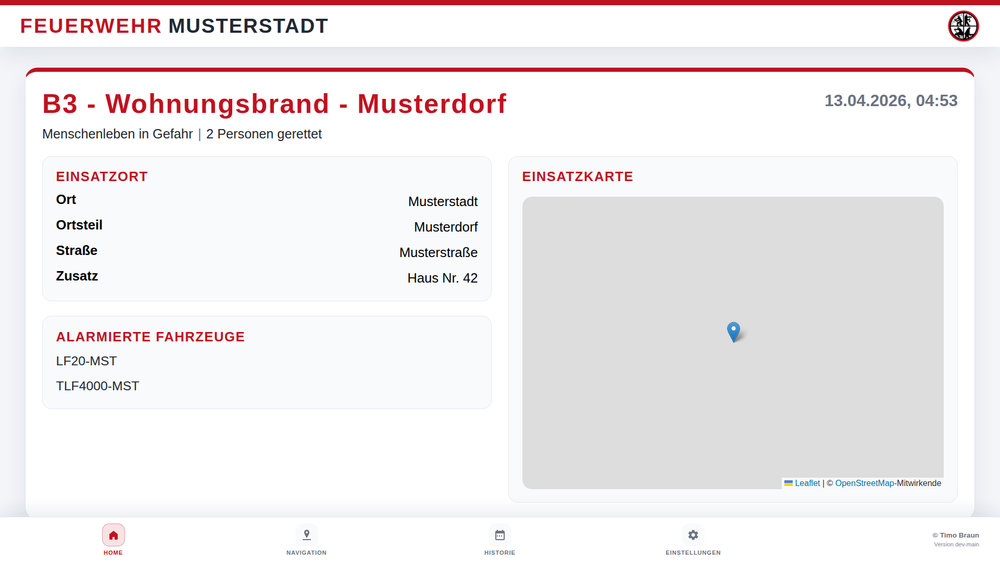
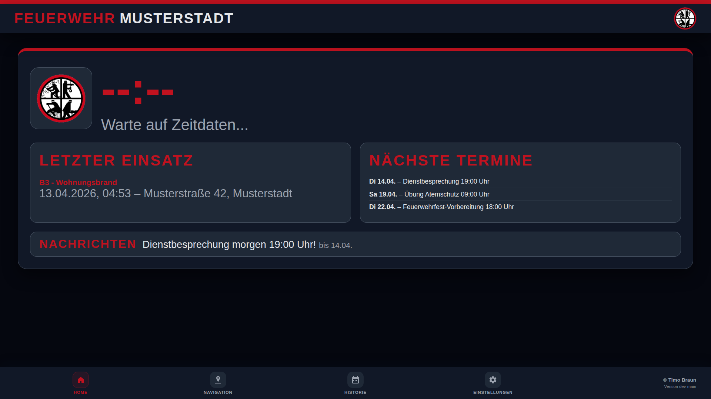
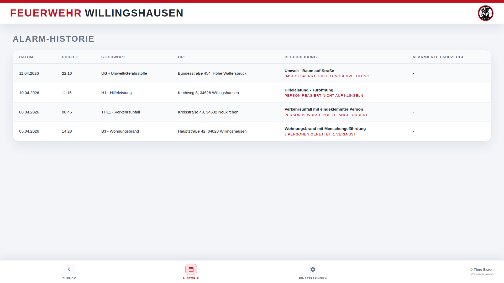
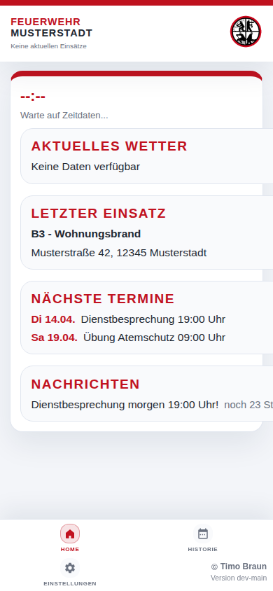

# Feuerwehr Alarm Monitor

Dieses Projekt stellt ein webbasiertes Dashboard bereit, das Alarm-E-Mails
von einer Leitstelle automatisiert verarbeitet und einsatzrelevante
Informationen inklusive Karten- und Wetteranzeige darstellt. Es eignet sich
für Installationen im lokalen Netzwerk, bei denen ein Gerät als Server
fungiert und weitere Geräte das Dashboard im Vollbildmodus anzeigen. Als
Server oder Client können sowohl Raspberry Pis als auch klassische PCs,
Notebooks oder Smart-Displays eingesetzt werden.

## Screenshots

### Dashboard – Alarmansicht
Bei einem aktiven Einsatz zeigt das Dashboard alle relevanten Informationen wie Stichwort, Einsatzort, alarmierte Fahrzeuge und Wetterdaten an.



### Dashboard – Standardansicht (Idle)
Die Standardansicht zeigt Uhrzeit, Datum, aktuelles Wetter und den letzten Einsatz an.



### Einsatzhistorie
Die Historie zeigt alle vergangenen Einsätze in einer übersichtlichen Tabelle.



### Mobile Ansicht
Die mobile Ansicht ist für Smartphones und Tablets optimiert.



## Funktionsumfang

* **API-basierter Alarmempfang** – Empfängt Alarme vom alarm-mail Service 
  über einen authentifizierten REST-API-Endpunkt.
* **Datenspeicherung & Historie** – Speichert alle Alarme persistent und 
  stellt eine durchsuchbare Einsatzhistorie bereit.
* **Geokodierung** – Ermittelt Koordinaten über OpenStreetMap (Nominatim), 
  falls nicht in den Alarmdaten enthalten.
* **Interaktive Karte** – Zeigt den Einsatzort auf einer OpenStreetMap-Karte 
  mittels Leaflet an.
* **Wetterdaten** – Ruft aktuelle Wetterdaten über die Open-Meteo API ab.
* **Gruppenfilterung** – Filtert Alarme optional nach TME-Codes oder 
  Gruppennamen.
* **Dashboard** – Webbasierte Oberfläche optimiert für Kiosk-/Vollbildmodus.
* **Idle-Ansicht** – Automatischer Wechsel auf Standardanzeige mit Uhrzeit, 
  Lokalwetter und Vereinswappen nach konfigurierbarer Anzeigedauer 
  (Standard: 30 Minuten).
* **Letzter Einsatz** – Darstellung des zuletzt eingegangenen Einsatzes in 
  der Idle-Ansicht.
* **Einsatzhistorie** – Abrufbare Liste aller vergangenen Einsätze über 
  Dashboard-Button oder REST-API.
* **Mobile Ansicht** – Separate mobilfreundliche Ansicht unter `/mobile` für 
  Smartphones und Tablets mit direktem Navigations-Button (Apple Karten / 
  Google Maps).
* **Navigation** – Dedizierte Navigationsseite mit Routenplanung (optional 
  mit OpenRouteService).
* **Messenger-Integration** – Optional: Anzeige von Teilnehmerrückmeldungen 
  vom alarm-messenger System.

## Architekturüberblick

```
+------------------+         +-------------------+         +----------------------+        +-------------------+
|  IMAP Postfach   | ---->   |  alarm-mail       | ---->   |  alarm-monitor       | ---->  |  Browser Clients  |
|  (Leitstelle)    |         |  Service          |         |  (Dashboard)         |        |  Endgeräte        |
+------------------+         +-------------------+         +----------------------+        +-------------------+
                                     |                               |                              |
                                     v                               v                              v
                              E-Mail Parsing              Geokodierung & Wetter             Leaflet Dashboard
                              XML → JSON                  Speicherung & API
                                     |
                                     v
                            +-------------------+
                            | alarm-messenger   |
                            | (optional)        |
                            +-------------------+
                                     |
                                     v
                            Teilnehmerrückmeldungen
                            Mobile Benachrichtigungen
```

Das System besteht aus mehreren entkoppelten Komponenten:

1. **alarm-mail Service** – Ein separater Microservice, der regelmäßig das
   IMAP-Postfach der Leitstelle abfragt, E-Mails parst (XML → JSON) und
   validierte Alarme über eine REST-API an den alarm-monitor sendet.

2. **alarm-monitor (Dashboard)** – Empfängt Alarme über einen
   authentifizierten API-Endpunkt, reichert sie mit Geodaten und Wetter an,
   speichert sie und stellt sie über ein webbasiertes Dashboard dar.

3. **alarm-messenger (optional)** – Ein optionaler Service für mobile
   Push-Benachrichtigungen und Teilnehmerrückmeldungen. Wird von alarm-mail
   über neue Alarme informiert und stellt Rückmeldedaten für alarm-monitor
   bereit.

Diese Architektur ermöglicht eine klare Trennung der Verantwortlichkeiten,
einfachere Wartbarkeit und flexible Skalierung der einzelnen Komponenten.

## Funktionsweise im Überblick

1. **E-Mail-Empfang (alarm-mail Service)** – Der alarm-mail Service verbindet 
   sich in konfigurierbaren Intervallen mit dem IMAP-Postfach der Leitstelle 
   und sucht nach neuen, ungelesenen Nachrichten.
   
2. **Parsing & Validierung (alarm-mail Service)** – E-Mails im erwarteten 
   XML-Format werden geparst. Relevante Felder (z. B. Stichworte, Adresse, 
   Einsatzmittel) werden extrahiert und in JSON umgewandelt.
   
3. **API-Übermittlung** – Der alarm-mail Service sendet die validierten 
   Alarmdaten via HTTP POST an den `/api/alarm` Endpunkt des alarm-monitor. 
   Die Authentifizierung erfolgt über einen API-Key im `X-API-Key` Header.
   
4. **Anreicherung (alarm-monitor)** – Der alarm-monitor empfängt den Alarm, 
   prüft auf Duplikate und Gruppenfilter. Falls keine Koordinaten mitgeliefert 
   werden, wird der Einsatzort per Nominatim geokodiert. Anschließend werden 
   passende Wetterdaten über Open-Meteo abgerufen.
   
5. **Speicherung & Benachrichtigung** – Der Alarm wird in der Historie 
   gespeichert. Optional wird das alarm-messenger System informiert, um 
   mobile Push-Benachrichtigungen an registrierte Geräte zu senden.
   
6. **Visualisierung** – Das Flask-Backend stellt die Daten über verschiedene 
   Routen bereit: Dashboard (`/`), Mobile-Ansicht (`/mobile`), Navigation 
   (`/navigation`) und Historie (`/history`). Browser-Clients können die 
   Daten in Echtzeit abrufen und anzeigen.

## Installation

Die Anwendung kann sowohl klassisch in einer lokalen Python-Umgebung als
auch containerisiert mit Docker beziehungsweise Docker Compose betrieben
werden. In beiden Varianten erfolgt die Konfiguration komfortabel über
Environment-Variablen, die beispielsweise in einer `.env` Datei
gespeichert werden.

### Native Installation (Python)

1. **System vorbereiten**
   ```bash
   sudo apt update
   sudo apt install python3 python3-venv python3-pip
   ```

2. **Projekt klonen und Umgebung erstellen**
   ```bash
   git clone <repo-url>
   cd alarm-dashboard
   python3 -m venv .venv
   source .venv/bin/activate
   pip install -r requirements.txt
   ```

3. **Konfiguration festlegen**

   Passen Sie `.env.example` an und speichern Sie die Datei als `.env`.
   Alternativ können die Variablen direkt exportiert werden:

   ```bash
   # API-Key für Alarmempfang (erforderlich)
   # SICHERHEITSHINWEIS: Generieren Sie den Key separat, um ihn nicht in der Shell-History zu speichern
   openssl rand -hex 32  # Kopieren Sie den Output
   export ALARM_DASHBOARD_API_KEY=<eingefügter-key>
   
   # Optionale Anzeigeeinstellungen
   export ALARM_DASHBOARD_FIRE_DEPARTMENT_NAME="Feuerwehr Musterstadt"
   export ALARM_DASHBOARD_DEFAULT_LATITUDE=52.52
   export ALARM_DASHBOARD_DEFAULT_LONGITUDE=13.405
   export ALARM_DASHBOARD_DEFAULT_LOCATION_NAME="Feuerwache Musterstadt"
   export ALARM_DASHBOARD_DISPLAY_DURATION_MINUTES=30
   ```

   **Wichtig:** 
   - Notieren Sie sich den generierten API-Key sicher (z. B. in einem Passwort-Manager)
   - Der API-Key wird für die Konfiguration des alarm-mail Service benötigt
   - Verwenden Sie für produktive Umgebungen immer `.env`-Dateien statt Export-Befehlen
   
   Weitere optionale Variablen wie `ALARM_DASHBOARD_GRUPPEN`,
   `ALARM_DASHBOARD_NOMINATIM_URL` oder `ALARM_DASHBOARD_WEATHER_PARAMS`
   können bei Bedarf gesetzt werden (siehe Abschnitt "Konfiguration über
   Environment-Variablen").

4. **Anwendung starten**
   ```bash
   flask --app alarm_dashboard.app run --host 0.0.0.0 --port 8000
   ```

   Alternativ kann `python -m alarm_dashboard.app` genutzt werden.

5. **Dashboard anzeigen**

   Öffnen Sie im lokalen Netzwerk `http://<server-ip>:8000` im Browser der
   gewünschten Anzeige-Geräte (z. B. Raspberry Pi, PC, Notebook, Tablet)
   und aktivieren Sie bei Bedarf den Kiosk- oder Vollbildmodus.

### Container Deployment (Docker)

1. **.env vorbereiten**

   ```bash
   cp .env.example .env
   # Datei bearbeiten und Zugangsdaten eintragen
   ```

2. **Container bauen und starten**

   ```bash
   docker compose up --build
   ```

   `compose.yaml` liest die Variablen aus `.env` ein und startet den
   Container auf Port `8000`. Das lokale Verzeichnis `./instance` wird in
   den Container gemountet, sodass die Datei `instance/alarm_history.json`
   auch nach dem Neuerstellen des Containers erhalten bleibt. Bei Bedarf
   können zusätzliche Environment-Variablen direkt in der Compose-Datei
   oder beim Aufruf (`docker compose run -e ...`) gesetzt werden.

3. **Log- und Health-Prüfung**

   ```bash
   docker compose logs -f
   docker compose ps
   ```

   Der Container verfügt über einen Healthcheck (`/health` Endpoint).

4. **Stoppen & Aktualisieren**

   ```bash
   docker compose down
   ```

   Nach Code- oder Konfigurationsänderungen genügt ein erneutes
   `--build`, um das Image zu aktualisieren.

5. **Skalierung im LAN**

   Für weitere Anzeige-Clients reicht ein Browser, der auf
   `http://<server-ip>:8000` (Desktop) bzw. `http://<server-ip>:8000/mobile`
   zeigt. Containerisierte Clients können denselben Compose-Stack nutzen
   oder mittels Reverse-Proxy auf das Dashboard zugreifen.

### Einrichtung des alarm-mail Service

Der alarm-monitor empfängt Alarme über eine REST-API. Dazu wird der
**alarm-mail Service** benötigt, der das IMAP-Postfach überwacht und
Alarm-E-Mails an den Monitor weiterleitet.

1. **alarm-mail Repository klonen**
   ```bash
   git clone https://github.com/TimUx/alarm-mail.git
   cd alarm-mail
   ```

2. **Konfiguration erstellen**
   ```bash
   cp .env.example .env
   nano .env
   ```

   Tragen Sie folgende Werte ein:
   ```bash
   # IMAP-Konfiguration (für E-Mail-Abruf)
   ALARM_MAIL_IMAP_HOST=imap.example.com
   ALARM_MAIL_IMAP_PORT=993
   ALARM_MAIL_IMAP_USE_SSL=true
   ALARM_MAIL_IMAP_USERNAME=alarm@feuerwehr.de
   ALARM_MAIL_IMAP_PASSWORD=geheim
   ALARM_MAIL_IMAP_MAILBOX=INBOX
   ALARM_MAIL_POLL_INTERVAL=60
   
   # alarm-monitor Integration (Ziel-API)
   # Hinweis: HTTP ist für interne Docker-Netzwerke akzeptabel.
   # Für Produktivumgebungen über das Internet verwenden Sie HTTPS.
   ALARM_MAIL_MONITOR_URL=http://alarm-monitor:8000
   ALARM_MAIL_MONITOR_API_KEY=<der-generierte-api-key>
   
   # Optional: alarm-messenger Integration
   # ALARM_MAIL_MESSENGER_URL=http://alarm-messenger:3000
   # ALARM_MAIL_MESSENGER_API_KEY=<messenger-api-key>
   ```

3. **Service starten**
   ```bash
   docker compose up -d
   ```

Der alarm-mail Service ruft nun regelmäßig das IMAP-Postfach ab, parst
eingehende Alarm-E-Mails und sendet sie automatisch an den alarm-monitor.

**Hinweis:** Für eine gemeinsame Docker-Compose-Installation können beide
Services in einer einzigen `compose.yaml` definiert werden. Siehe dazu die
Dokumentation im alarm-mail Repository.

### Konfiguration über Environment-Variablen

Alle Variablen tragen den Präfix `ALARM_DASHBOARD_`. Pflichtfelder sind
markiert.

| Variable | Pflicht | Beschreibung |
| --- | --- | --- |
| `API_KEY` | ja | API-Schlüssel für den Empfang von Alarmen vom alarm-mail Service. Generieren mit `openssl rand -hex 32`. |
| `GRUPPEN` | nein | Kommagetrennte Liste von TME-Codes oder Gruppennamen; filtert Einsätze auf bestimmte Gruppen. |
| `DISPLAY_DURATION_MINUTES` | nein (Default `30`) | Dauer, wie lange ein Alarm sichtbar bleibt, bevor die Standardansicht erscheint. |
| `FIRE_DEPARTMENT_NAME` | nein (Default `Alarm-Monitor`) | Anzeigename, der in Kopfzeile und Idle-Ansicht erscheint. |
| `DEFAULT_LATITUDE` / `DEFAULT_LONGITUDE` | nein | Koordinaten für Wetter- und Kartendaten in der Idle-Ansicht, wenn kein Alarm aktiv ist. |
| `DEFAULT_LOCATION_NAME` | nein | Beschriftung der Idle-Ansicht (z. B. Standort der Wache). |
| `NOMINATIM_URL` | nein (Default `https://nominatim.openstreetmap.org/search`) | Basis-URL für die Geokodierung. |
| `WEATHER_URL` | nein (Default `https://api.open-meteo.com/v1/forecast`) | Basis-URL für Wetterabfragen. |
| `WEATHER_PARAMS` | nein | Query-Parameter für die Wetter-API (z. B. welche Felder geladen werden). |
| `ORS_API_KEY` | nein | API-Key für OpenRouteService, falls Navigation mit Routenführung verwendet werden soll. |
| `MESSENGER_SERVER_URL` | nein | Basis-URL des Alarm-Messenger-Servers für mobile Benachrichtigungen. |
| `MESSENGER_API_KEY` | nein | API-Key/Token zur Authentifizierung beim Alarm-Messenger-Server. |
| `HISTORY_FILE` | nein | Pfad zur JSON-Datei, in der Historien-Daten persistiert werden. Standard: `instance/alarm_history.json`. |
| `APP_VERSION` | nein (Default `dev-main`) | Versionskennung, die im Footer angezeigt und zur Release-Verlinkung genutzt wird. |
| `APP_VERSION_URL` | nein | Überschreibt den Link auf die GitHub-Release-Seite (Standard: automatisch anhand der Version). |

Eine befüllte `.env` könnte beispielsweise so aussehen:

```bash
# API-Key für Alarmempfang (erforderlich)
ALARM_DASHBOARD_API_KEY=a1b2c3d4e5f6...  # Generiert mit: openssl rand -hex 32

# Anzeigeeinstellungen
ALARM_DASHBOARD_FIRE_DEPARTMENT_NAME=Feuerwehr Beispielstadt
ALARM_DASHBOARD_DISPLAY_DURATION_MINUTES=30
ALARM_DASHBOARD_DEFAULT_LATITUDE=51.2345
ALARM_DASHBOARD_DEFAULT_LONGITUDE=9.8765
ALARM_DASHBOARD_DEFAULT_LOCATION_NAME=Wache Beispielstadt

# Optional: Gruppenfilter (TME-Codes)
ALARM_DASHBOARD_GRUPPEN=

# Optional: Navigation und Versionierung
ALARM_DASHBOARD_ORS_API_KEY=
ALARM_DASHBOARD_APP_VERSION=v1.2.3
ALARM_DASHBOARD_APP_VERSION_URL=https://github.com/TimUx/alarm-monitor/releases/tag/v1.2.3

# Optional: Alarm-Messenger Integration für Teilnehmerrückmeldungen
ALARM_DASHBOARD_MESSENGER_SERVER_URL=https://messenger.example.com
ALARM_DASHBOARD_MESSENGER_API_KEY=your-messenger-api-key-here
```

#### Integration mit Alarm-Messenger

Der Alarm-Monitor kann eingehende Einsätze automatisch an einen externen
Alarm-Messenger-Server weiterleiten, um mobile Endgeräte zu benachrichtigen.
Die Integration ist optional und wird aktiviert, sobald die entsprechenden
Umgebungsvariablen gesetzt sind:

* `ALARM_DASHBOARD_MESSENGER_SERVER_URL` – Basis-URL des Alarm-Messenger-Servers
  (z. B. `https://messenger.example.com`)
* `ALARM_DASHBOARD_MESSENGER_API_KEY` – API-Key oder Token zur Authentifizierung

Sobald beide Variablen konfiguriert sind, werden alle verarbeiteten Alarme
als JSON-Payload via HTTP POST an den Endpunkt `/api/alarm` des
Messenger-Servers übermittelt. Die Authentifizierung erfolgt über einen
`Authorization: Bearer <token>` Header. Bei Fehlern oder Timeouts werden
diese geloggt, beeinträchtigen jedoch nicht die Hauptfunktion des Dashboards.

Wird die Messenger-URL nicht gesetzt oder fehlt der API-Key, bleibt die
Funktion deaktiviert, und Alarme werden ausschließlich lokal gespeichert
und im Dashboard angezeigt.
```

#### Alarmaktivierung über Gruppenfilter

Über die Variable `ALARM_DASHBOARD_GRUPPEN` lassen sich die anzuzeigenden
Alarme auf bestimmte TME-Gruppen einschränken. Hinterlegen Sie eine
kommagetrennte Liste (z. B. `ALARM_DASHBOARD_GRUPPEN=WIL26,WIL41`). Das
Dashboard reagiert nur dann auf eingehende Meldungen, wenn mindestens einer
dieser Codes im Abschnitt `<TME>` der Einsatzmaßnahmen vorkommt. Wird kein
Filter gesetzt, werden weiterhin alle eingehenden Alarme dargestellt.

Die maximale Dauer, wie lange ein Alarm aktiv sichtbar bleibt, kann über
`ALARM_DASHBOARD_DISPLAY_DURATION_MINUTES` angepasst werden. Standardmäßig
kehrt das Dashboard nach 30 Minuten ohne neue Meldung in die Standardansicht
zurück. Setzen Sie bei Bedarf z. B. `ALARM_DASHBOARD_DISPLAY_DURATION_MINUTES=45`.

## Speicherung von Alarmen und Historie

Eingehende Einsätze werden in der Klasse `AlarmStore` gespeichert
(`alarm_dashboard/storage.py`). Die Komponente hält den zuletzt
eingegangenen Alarm im Speicher bereit, verwaltet eine Historie und
persistiert die Daten optional als JSON-Datei. Standardmäßig wird der
Pfad `instance/alarm_history.json` innerhalb des Flask
`instance`-Verzeichnisses genutzt. Das Verzeichnis liegt außerhalb des
Repositorys, ist beschreibbar und wird beim Anwendungsstart automatisch
angelegt.

Der Speicherort lässt sich über die Konfiguration anpassen:

* Setzen Sie die Umgebungsvariable `ALARM_DASHBOARD_HISTORY_FILE` (z. B.
  in `.env`), um einen absoluten oder relativen Pfad vorzugeben.
* Alternativ kann `history_file` beim Erstellen einer `AppConfig`
  übergeben werden.

Sobald ein eigener Pfad gesetzt ist, schreibt `AlarmStore` die Daten
direkt dorthin. Bei einem Neustart der Anwendung wird die Datei wieder
eingelesen, sodass der letzte Alarm und die Historie erhalten bleiben.

## Einsatzhistorie & Standardansicht

Sobald kein aktueller Alarm vorliegt oder der letzte Alarm älter als die
eingestellte Anzeigedauer ist, wechselt das Dashboard automatisch in die
Standardansicht.
Diese zeigt neben Uhrzeit, Wetter und Wappen auch kompakt den zuletzt
eingegangenen Einsatz (Datum/Uhrzeit und Stichwort) an. Über den Button
"Historie ansehen" führt ein Link zur tabellarischen Übersicht der
letzten Einsätze, die sowohl vom großen Dashboard als auch aus der
mobilen Ansicht erreichbar ist.

Die tabellarische Übersicht ist direkt unter `http://<server>/history`
erreichbar. Die zugrunde liegenden Daten können außerdem per API
abgefragt werden:

* `GET /api/history` – liefert die gespeicherten Einsätze (neuester zuerst).
  Optional kann mit dem Query-Parameter `limit` die Anzahl der Einträge
  begrenzt werden (maximal 500). Jedes Element enthält u.a. Zeitstempel,
  Stichwort, Ort, Diagnose/Beschreibung, Bemerkungen und alarmierte Fahrzeuge.
* `GET /api/alarm` – wie bisher, ergänzt im Idle-Fall um das Feld
  `last_alarm`, das die wichtigsten Informationen des letzten Einsatzes
  enthält und für die kompakte Anzeige genutzt wird.

Für einfache mobile Zugriffe ohne native App stehen die mobiloptimierte Route `/mobile` sowie die JSON-API `GET /api/mobile/alarm` zur Verfügung. Beide Varianten greifen auf dieselben Alarm- und Historieninformationen wie das Hauptdashboard zu und aktualisieren sich automatisch.

Die mobile Oberfläche blendet zusätzlich einen Button "Navigation starten" ein, der je nach Endgerät Apple Karten oder Google Maps mit den übermittelten Koordinaten bzw. Adressdaten öffnet, sodass die Anfahrt direkt begonnen werden kann.

## Standardansicht & Gestaltung

* In Ruhephasen blendet das Dashboard eine großformatige Uhr, das lokale
  Wetter sowie das Gemeindewappen ein. Die Ansicht greift dabei auf die
  konfigurierten Standardkoordinaten zurück.
* Läuft ein Alarm länger als die konfigurierte Anzeigedauer, wird
  automatisch in die Standardansicht gewechselt, um Fehlinterpretationen
  zu vermeiden.

Das Design kann an eigene Bedürfnisse angepasst werden:

1. **Feuerwehrname konfigurieren** – Hinterlegen Sie den gewünschten Namen
   über `ALARM_DASHBOARD_FIRE_DEPARTMENT_NAME` in Ihrer `.env`. Der Wert
   erscheint prominent in der Kopfzeile sowie in der Standardansicht.
2. **Wappen oder Logo austauschen** – Ersetzen Sie die Datei
   `alarm_dashboard/static/img/crest.png` durch ein eigenes Bild (PNG mit
   transparentem Hintergrund empfohlen). Verwenden Sie entweder denselben
   Dateinamen oder passen Sie in `alarm_dashboard/app.py` den Pfad im Aufruf
   `url_for("static", filename="img/crest.png")` an, falls Sie einen anderen
   Dateinamen nutzen möchten.
3. **Farbschema anpassen** – Die zentralen Farben sind als CSS-Variablen in
   `alarm_dashboard/static/css/dashboard.css` definiert (Abschnitt `:root`
   für den Alarmmodus, `body.mode-idle` für die Standardansicht). Weitere
   Ansichten verwenden `history.css` und `mobile.css`. Durch Anpassen der
   Variablen `--accent`, `--background`, `--surface` usw. lässt sich das
   Erscheinungsbild schnell auf die eigenen Hausfarben abstimmen.

## Option: Betrieb auf dem Raspberry Pi

* Aktivieren Sie den Autostart der Flask-App via `systemd`-Service.
* Nutzen Sie `chromium-browser --kiosk http://<server-ip>:8000` oder
  `firefox --kiosk` auf dem Raspberry Pi, wenn dieser als Anzeige-Client
  dient.
* Stellen Sie sicher, dass die Geräte im gleichen LAN sind und der Server
  ausgehende Verbindungen zu IMAP, Nominatim und Open-Meteo aufbauen darf.
* Aus Sicherheitsgründen sollten keine Portweiterleitungen ins Internet
  eingerichtet werden.

## Entwicklung

* Konfigurationsdateien liegen unter `alarm_dashboard/config.py`.
* Der Mail-Polling-Thread ist in `alarm_dashboard/mail_checker.py`
  implementiert.
* Parsing-Logik befindet sich in `alarm_dashboard/parser.py`.
* Die Flask-App wird in `alarm_dashboard/app.py` erzeugt.
* Statische Assets (CSS/JS) liegen unter `alarm_dashboard/static/`.

### Beispiel-Alarm und Auswertung

Ein typischer Alarm trifft als XML im Format `<INCIDENT>` ein. Das
folgenden Beispiel nutzt vollständig anonymisierte Werte:

```xml
<?xml version="1.0" encoding="UTF-8"?>
<INCIDENT>
  <STICHWORT>F3Y</STICHWORT>
  <ESTICHWORT_1>F3Y</ESTICHWORT_1>
  <ESTICHWORT_2>Personen in Gefahr</ESTICHWORT_2>
  <ENR>7850001123</ENR>
  <FENR>F7850005120</FENR>
  <EBEGINN>24.07.2026 18:42:11</EBEGINN>
  <DIAGNOSE>Brand in Wohngebäudekomplex</DIAGNOSE>
  <EO_BEMERKUNG>Mehrere Anrufe, starke Rauchentwicklung</EO_BEMERKUNG>
  <ORT>Musterstadt</ORT>
  <ORTSTEIL>Nordviertel</ORTSTEIL>
  <STRASSE>Wehrgasse</STRASSE>
  <OBJEKT>Hausnummernblock 12-16</OBJEKT>
  <UNTEROBJEKT>Aufgang C</UNTEROBJEKT>
  <ORTSZUSATZ>Rückseite über Innenhof</ORTSZUSATZ>
  <GMA></GMA>
  <HAUSNUMMER>14</HAUSNUMMER>
  <KOORDINATE_LAT>51.245678</KOORDINATE_LAT>
  <KOORDINATE_LON>9.845321</KOORDINATE_LON>
  <KOORDINATE_UTM>32UNB1234567890</KOORDINATE_UTM>
  <EOZUSATZ>Anfahrt über Haupttor, Schlüssel im Depot</EOZUSATZ>
  <INFOTEXT>Bewohner werden evakuiert</INFOTEXT>
  <INFEKTION></INFEKTION>
  <ANFAHRTSHINWEIS>Zufahrt über Ringstraße</ANFAHRTSHINWEIS>
  <AAO>LF Musterstadt 1;DLK Musterstadt;ELW Musterstadt</AAO>
  <EINSATZMASSNAHMEN>
    <FME>
      <BEZEICHNUNG>MUS Zugführung (FME M120)</BEZEICHNUNG><AUSFUE_ZEIT>20260724184410</AUSFUE_ZEIT>
      <BEZEICHNUNG>MUS Löschzug (FME M118)</BEZEICHNUNG><AUSFUE_ZEIT>20260724184410</AUSFUE_ZEIT>
    </FME>
    <TME>
      <BEZEICHNUNG>MUS Nord 1 (TME MUS11)</BEZEICHNUNG><AUSFUE_ZEIT>20260724184430</AUSFUE_ZEIT>
      <BEZEICHNUNG>MUS Innenstadt (TME MUS05)</BEZEICHNUNG><AUSFUE_ZEIT>20260724184502</AUSFUE_ZEIT>
    </TME>
  </EINSATZMASSNAHMEN>
</INCIDENT>
```

Der Parser ordnet die Felder wie folgt zu und stellt sie im Dashboard dar:

* **Alarm-Header** – `ESTICHWORT_1` liefert die Überschrift. Ein
  vorhandenes `ESTICHWORT_2` wird als Untertitel eingeblendet. `EBEGINN`
  erscheint als Zeitstempel neben dem Stichwort.
* **Detailkarte und Adresse** – `ORT`, `ORTSTEIL`, `STRASSE`,
  `HAUSNUMMER`, `OBJEKT` und `ORTSZUSATZ` bilden den Adressblock unterhalb
  der Karte. `KOORDINATE_LAT`/`KOORDINATE_LON` positionieren den Marker
  und dienen der Wetterabfrage. Liegen keine Koordinaten vor, wird anhand
  der Adressdaten geokodiert.
* **Diagnose & Hinweise** – `DIAGNOSE`, `EO_BEMERKUNG`, `INFOTEXT` und
  `EOZUSATZ` erscheinen in den hervorgehobenen Textboxen. `EO_BEMERKUNG`
  wird rot markiert, um kritische Zusatzinfos hervorzuheben.
* **AAO & Einheiten** – `AAO` speist die Liste der alarmierten Fahrzeuge
  in der rechten Spalte. Die Abschnitte `<FME>` und `<TME>` werden
  einzeln aufgeführt; optional filtert `ALARM_DASHBOARD_GRUPPEN` auf
  bestimmte TME-Codes. Anzeige erfolgt in den Tabellen „Funkmeldeempfänger“
  und „Telefonmeldeempfänger“.
* **Historie & API** – `ENR`/`FENR` sowie sämtliche Kerninformationen
  werden persistent gespeichert und erscheinen in der Einsatzhistorie
  (`/history`) sowie in den API-Endpunkten (`/api/alarm`, `/api/history`).

Fehlen einzelne Felder, bleiben die entsprechenden Bereiche leer bzw.
werden mit `-` gekennzeichnet. Liegen Koordinaten vor, wird keine
zusätzliche Geokodierung mehr benötigt.

### Tests und lokale Entwicklung

Für lokale Tests können Beispiel-E-Mails als `.eml` Datei abgelegt und
über ein kleines Skript in den Store eingelesen werden. Die Anwendung
ist so ausgelegt, dass der Mail-Poller auch deaktiviert werden kann,
indem die `AlarmMailFetcher`-Instanz nicht gestartet wird. Nutzen Sie z.B.
Postman oder `curl`, um die API unter `http://localhost:8000/api/alarm`
anzufragen.

## Lizenz

Dieses Projekt steht unter der MIT-Lizenz.
