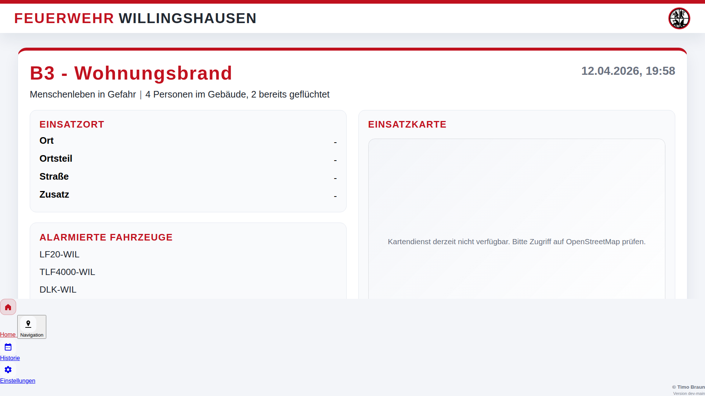

# 📸 Screenshot-Dokumentation

Dieser Guide beschreibt alle Screenshots und Ansichten des Alarm Monitor Systems.

---

## Inhaltsverzeichnis

- [Dashboard-Ansichten](#dashboard-ansichten)
- [Mobile-Ansichten](#mobile-ansichten)
- [Historie-Ansichten](#historie-ansichten)
- [Navigations-Ansichten](#navigations-ansichten)
- [Admin-Ansichten](#admin-ansichten)
- [Fehler-Ansichten](#fehler-ansichten)
- [Screenshots erstellen](#screenshots-erstellen)

---

## Dashboard-Ansichten

### Dashboard – Alarmansicht (Aktiver Einsatz)

**Datei**: `docs/screenshots/dashboard-alarm.png`

**Beschreibung**: Vollbild-Ansicht eines aktiven Alarms mit allen relevanten Informationen.

**Angezeigte Elemente**:
- ✅ Alarm-Header mit Stichwort und Zeitstempel
- ✅ Interaktive Karte mit Einsatzort-Marker
- ✅ Vollständige Adressinformationen
- ✅ Wetterdaten (Temperatur, Niederschlag, Wind)
- ✅ Diagnose und Bemerkungen (rot hervorgehoben)
- ✅ Zusatzinformationen und Hinweise
- ✅ Alarmierte Fahrzeuge (AAO)
- ✅ Funkmeldeempfänger (FME) mit Alarmierungszeit
- ✅ Telefonmeldeempfänger (TME) mit Alarmierungszeit

**Verwendung**: Hauptanzeige für Alarmdarstellung auf großen Displays


---

### Dashboard – Teilnehmerrückmeldungen

**Datei**: `docs/screenshots/dashboard-messenger-feedback.png`

**Beschreibung**: Alarmansicht mit zusätzlicher Anzeige von Teilnehmerrückmeldungen vom alarm-messenger.

**Angezeigte Elemente**:
- ✅ Alle Elemente der Standard-Alarmansicht
- ✅ **Zusätzlich**: Panel mit Teilnehmerrückmeldungen
  - Namen der Teilnehmer
  - Zusagen (✓ grün)
  - Absagen (✗ rot)
  - Ausstehende Rückmeldungen (⏳ grau)
  - Qualifikationen (z.B. Atemschutz, Maschinist)
  - Führungsrollen (z.B. Zugführer)
  - Kommentare/Notizen
- ✅ Zusammenfassung (X Zusagen • Y Absagen • Z Ausstehend)

**Verwendung**: Einsatzleitung kann sehen, wer verfügbar ist und welche Qualifikationen vorhanden sind



---

### Dashboard – Idle-Ansicht (Ruhezustand)

**Datei**: `docs/screenshots/dashboard-idle.png`

**Beschreibung**: Standardansicht wenn kein aktiver Alarm vorliegt oder der letzte Alarm die maximale Anzeigedauer überschritten hat.

**Angezeigte Elemente**:
- ✅ Große digitale Uhr (Stunden:Minuten:Sekunden)
- ✅ Aktuelles Datum (Wochentag, TT.MM.YYYY)
- ✅ Vereinswappen/Logo (anpassbar)
- ✅ Feuerwehr-Name
- ✅ Lokales Wetter am Standort
  - Temperatur
  - Wetter-Icon
  - Niederschlagswahrscheinlichkeit
- ✅ **Letzter Einsatz** (kompakte Anzeige):
  - Zeitstempel
  - Stichwort
  - Kurzbeschreibung
- ✅ Button "Historie ansehen"
- ✅ Versions-Anzeige im Footer

**Verwendung**: Permanente Anzeige in der Wache, wenn kein Einsatz aktiv ist


---

## Mobile-Ansichten

### Mobile – Idle-Ansicht

**Datei**: `docs/screenshots/mobile-idle.png`

**Beschreibung**: Mobiloptimierte Ansicht für Smartphones und Tablets im Ruhezustand.

**Angezeigte Elemente**:
- ✅ Responsive Header mit Feuerwehr-Name
- ✅ Touch-freundliche Bedienelemente
- ✅ Kompakte Uhr und Datum
- ✅ Wetter-Informationen
- ✅ Letzter Einsatz (wenn vorhanden)
- ✅ Navigation-Button zur Historie

**Besonderheiten**:
- Optimiert für Touch-Bedienung
- Automatische Schriftgrößenanpassung
- Hochformat-optimiert
- Weniger Details als Desktop-Version

**Verwendung**: Zugriff von Smartphones und Tablets, ideal für unterwegs


---

### Mobile – Alarmansicht

**Status**: Screenshot noch zu erstellen

**Beschreibung**: Mobiloptimierte Alarmdarstellung mit folgenden Elementen:

**Geplante Elemente**:
- ✅ Kompakter Alarm-Header
- ✅ Vereinfachte Karte (kleinere Ansicht)
- ✅ Wesentliche Adressinformationen
- ✅ **"Navigation starten" Button** (prominent platziert)
  - Öffnet Apple Karten (iOS)
  - Öffnet Google Maps (Android)
  - Übergibt Koordinaten oder Adresse
- ✅ Wichtigste Einsatzinfos
- ✅ Alarmierte Fahrzeuge (kompakt)

**Verwendung**: Schneller Zugriff auf Alarminfos und Navigation

---

## Historie-Ansichten

### Historie – Tabellenansicht

**Datei**: `docs/screenshots/history-alarm.png`

**Beschreibung**: Tabellarische Übersicht aller vergangenen Einsätze.

**Angezeigte Elemente**:
- ✅ Such-/Filterfeld
- ✅ Sortierbare Spalten:
  - Datum/Uhrzeit
  - Stichwort
  - Ort
  - Diagnose
  - Alarmierte Fahrzeuge
- ✅ Pagination (bei vielen Einträgen)
- ✅ Zurück-Button zum Dashboard

**Funktionen**:
- Sortierung nach Spalten (Klick auf Header)
- Filterung über Suchfeld
- Responsive Layout für mobile Geräte

**Verwendung**: Nachschlagen vergangener Einsätze, Statistiken


---

## Navigations-Ansichten

### Navigation – Routenansicht

**Status**: Screenshot noch zu erstellen

**Beschreibung**: Dedizierte Navigationsseite mit Routenplanung zum Einsatzort.

**Geplante Elemente**:
- ✅ Großformatige Karte
- ✅ Start- und Zielpunkt markiert
- ✅ Route eingezeichnet (wenn OpenRouteService konfiguriert)
- ✅ Entfernungsangabe (km)
- ✅ Geschätzte Fahrzeit
- ✅ Alternativ-Routen (falls verfügbar)
- ✅ Zurück-Button zum Dashboard

**Verwendung**: Detaillierte Routenplanung auf Desktop, z.B. für Einsatzleitung

---

## Admin-Ansichten

### Health-Check

**Endpoint**: `/health`

**Beschreibung**: Minimale JSON-Antwort für Monitoring.

**Antwort**:
```json
{
  "status": "ok"
}
```

**Verwendung**: Docker Health-Checks, Monitoring-Systeme

---

## Fehler-Ansichten

### 404 – Seite nicht gefunden

**Status**: Screenshot noch zu erstellen

**Beschreibung**: Fehlerseite bei ungültigen URLs.

**Geplante Elemente**:
- ❌ 404 Überschrift
- ℹ️ "Seite nicht gefunden"
- 🔙 Zurück zum Dashboard Button

---

### 500 – Server-Fehler

**Status**: Screenshot noch zu erstellen

**Beschreibung**: Fehlerseite bei Server-Problemen.

**Geplante Elemente**:
- ❌ 500 Überschrift
- ℹ️ "Ein Fehler ist aufgetreten"
- 🔙 Zurück zum Dashboard Button
- 📝 Kontakt-Information

---

## Screenshots erstellen

### Vorbereitung

1. **Testdaten vorbereiten**:
```bash
# Testalarm mit realistischen Daten senden
curl -X POST http://localhost:8000/api/alarm \
  -H "X-API-Key: $(grep ALARM_DASHBOARD_API_KEY .env | cut -d= -f2)" \
  -H "Content-Type: application/json" \
  -d @test-alarm.json
```

2. **Browser vorbereiten**:
   - Chrome/Firefox im Vollbild (F11)
   - Developer Tools öffnen (F12)
   - Responsive Design Mode aktivieren (für Mobile)

3. **Auflösung einstellen**:
   - Desktop: 1920×1080 (Full HD)
   - Mobile: 375×667 (iPhone SE) oder 414×896 (iPhone 11)
   - Tablet: 768×1024 (iPad)

### Screenshots aufnehmen

**Desktop**:
```bash
# Browser-Screenshot (Chrome)
# Rechtsklick → "Screenshot aufnehmen" → "Vollständiger Screenshot"

# Oder mit Werkzeug:
import -window root ~/screenshot.png
```

**Mobile**:
1. Developer Tools → Responsive Design Mode
2. Gerät auswählen (z.B. "iPhone SE")
3. Screenshot-Tool nutzen (im Developer Tools)

### Nachbearbeitung

1. **Zuschneiden**: Nur relevanten Bereich
2. **Sensible Daten entfernen**: 
   - Echte Adressen anonymisieren
   - Reale Namen durch "Max Mustermann" ersetzen
   - API-Keys unkenntlich machen
3. **Optimieren**:
```bash
# PNG optimieren
optipng screenshot.png

# Oder mit ImageMagick
convert screenshot.png -quality 85 screenshot-optimized.png
```

### Speichern

**Benennung**: `<view>-<state>-<variant>.png`

**Beispiele**:
- `dashboard-alarm-standard.png`
- `dashboard-alarm-messenger.png`
- `dashboard-idle.png`
- `mobile-idle.png`
- `mobile-alarm.png`
- `history-list.png`
- `navigation-route.png`

**Speicherort**: `docs/screenshots/`

### In Dokumentation einbinden

```markdown
### Beschreibung


**Verwendung**: ...
```

---

## Checkliste für neue Screenshots

Bei UI-Änderungen:

- [ ] Screenshots mit Testdaten erstellt
- [ ] Sensible Daten anonymisiert
- [ ] Bilder optimiert (Dateigröße < 500 KB)
- [ ] In `docs/screenshots/` gespeichert
- [ ] Korrekt benannt
- [ ] In Dokumentation referenziert:
  - [ ] README.md
  - [ ] Betriebshandbuch.md (falls relevant)
  - [ ] Dieser Guide (SCREENSHOTS.md)
- [ ] Alt-Text hinzugefügt (Barrierefreiheit)

---

## Fehlende Screenshots

**Noch zu erstellen**:

- [ ] `mobile-alarm.png` – Mobile Alarmansicht
- [ ] `navigation-route.png` – Navigation mit Route
- [ ] `error-404.png` – 404-Fehlerseite
- [ ] `error-500.png` – 500-Fehlerseite
- [ ] `dashboard-alarm-no-weather.png` – Alarm ohne Wetter
- [ ] `dashboard-alarm-geocoded.png` – Alarm mit nachträglich geocodierter Adresse
- [ ] `history-empty.png` – Leere Historie
- [ ] `mobile-history.png` – Historie auf Mobile

**Optional**:
- [ ] `dashboard-idle-custom-logo.png` – Mit individuellem Wappen
- [ ] `dashboard-alarm-night-mode.png` – Dunkles Farbschema
- [ ] `dashboard-alarm-multiple-locations.png` – Mehrere Einsatzorte (falls unterstützt)

---

## Best Practices

### DOs ✅

- **Realistische Daten** verwenden (aber anonymisiert)
- **Konsistente Auflösung** für ähnliche Screenshots
- **Gute Beleuchtung** (Kontrast)
- **Vollständige Ansicht** zeigen
- **Optimierte Dateigröße** (< 500 KB)

### DON'Ts ❌

- **Keine echten Einsatzdaten** (Datenschutz!)
- **Keine persönlichen Informationen** (Namen, Adressen)
- **Keine API-Keys oder Passwörter** sichtbar
- **Keine übermäßig großen Dateien** (> 1 MB)
- **Keine unscharfen Bilder**

---

<div align="center">

**Beitragen?**  
Erstellen Sie fehlende Screenshots und öffnen Sie einen [Pull Request](../CONTRIBUTING.md)!

[⬆ Zurück nach oben](#-screenshot-dokumentation)

</div>
