# 📸 Screenshot-Dokumentation

Dieser Guide beschreibt alle Screenshots und Ansichten des Alarm Monitor Systems.

**Auflösungen:**
- Desktop: **1920×1080** (Full HD)
- Mobile: **390×844** (iPhone 14)

**Farbmodi:**
- **Light** – Helles Theme (Alarmansichten, Verwaltungsseiten bei hellem System-Theme)
- **Dark** – Dunkles Theme (Ruhezustand Dashboard/Mobile, Verwaltungsseiten bei dunklem System-Theme)

> Dashboard und Mobile wechseln den Modus automatisch: **Alarm = Light**, **Idle/Unwetter = Dark**.
> Historie, Navigation und Einstellungen folgen dem System-Theme (`prefers-color-scheme`).

---

## Inhaltsverzeichnis

- [Übersicht](#übersicht)
- [Dashboard-Ansichten](#dashboard-ansichten)
- [Mobile-Ansichten](#mobile-ansichten)
- [Historie-Ansicht](#historie-ansicht)
- [Navigations-Ansicht](#navigations-ansicht)
- [Einstellungs-Ansicht](#einstellungs-ansicht)
- [Screenshots erstellen](#screenshots-erstellen)

---

## Übersicht

| Datei | Modus | Auflösung | Beschreibung |
|-------|-------|-----------|--------------|
| `dashboard-alarm-light.png` | Light | 1920×1080 | Dashboard – Alarmansicht |
| `dashboard-messenger-light.png` | Light | 1920×1080 | Dashboard – Teilnehmerrückmeldungen |
| `dashboard-idle-dark.png` | Dark | 1920×1080 | Ruhezustand – letzter Einsatz + Unwetter |
| `dashboard-idle-calendar-dark.png` | Dark | 1920×1080 | Ruhezustand – letzter Einsatz + Kalender |
| `dashboard-idle-no-last-alarm-dark.png` | Dark | 1920×1080 | Ruhezustand – Unwetter links, Kalender rechts |
| `mobile-alarm-light.png` | Light | 390×844 | Mobile – Alarmansicht |
| `mobile-idle-dark.png` | Dark | 390×844 | Mobile – Ruhezustand (Standardlayout) |
| `mobile-idle-no-last-alarm-dark.png` | Dark | 390×844 | Mobile – Ruhezustand ohne letzten Einsatz |
| `mobile-unwetter-dark.png` | Dark | 390×844 | Mobile – Unwetterwarnung (Detail) |
| `history-light.png` | Light | 1920×1080 | Einsatzhistorie |
| `history-dark.png` | Dark | 1920×1080 | Einsatzhistorie |
| `navigation-light.png` | Light | 1920×1080 | Navigationsseite |
| `navigation-dark.png` | Dark | 1920×1080 | Navigationsseite |
| `settings-light.png` | Light | 1920×1080 | Einstellungen (vollständige Seite) |
| `settings-dark.png` | Dark | 1920×1080 | Einstellungen (vollständige Seite) |

---

## Dashboard-Ansichten

### Dashboard – Alarmansicht (Light)

**Datei**: `docs/screenshots/dashboard-alarm-light.png`

**Angezeigte Elemente**:
- Alarm-Header mit Stichwort, Unterstichwort und Zeitstempel
- Diagnose und Bemerkungen
- Vollständige Adressinformationen und alarmierte Fahrzeuge
- Interaktive Karte mit Einsatzort-Marker
- Wetterdaten am Einsatzort
- Bottom-Navigation

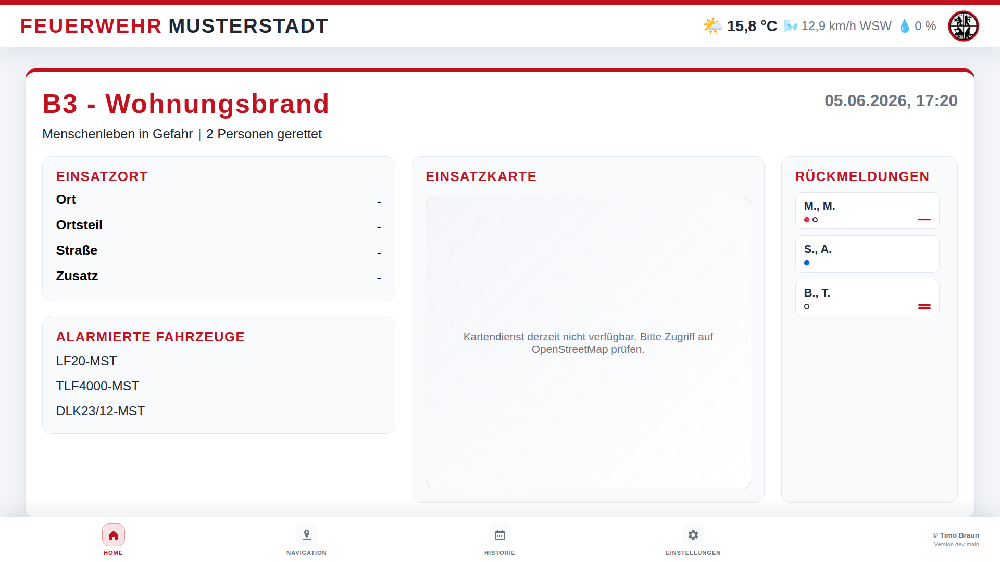

---

### Dashboard – Teilnehmerrückmeldungen (Light)

**Datei**: `docs/screenshots/dashboard-messenger-light.png`

**Angezeigte Elemente**:
- Alle Elemente der Standard-Alarmansicht
- Teilnehmerrückmeldungs-Panel mit Qualifikationen und Führungsrollen


---

### Dashboard – Ruhezustand mit Unwetter (Dark)

**Datei**: `docs/screenshots/dashboard-idle-dark.png`

**Layout**: Standard mit **„Letzten Einsatz im Ruhezustand anzeigen“** aktiv — letzter Einsatz links, Unwetterwarnung rechts.

**Angezeigte Elemente**:
- Digitale Uhr und Datum
- Aktuelles Wetter am Standort
- Letzter Einsatz (links)
- Simulierte DWD-Unwetterwarnung (rechts)
- Dashboard-Nachrichten

**Voraussetzung**: `ALARM_MONITOR_DWD_WARNINGS_MOCK=true` oder Einstellungen → „Unwetterwarnung simulieren (Test)"

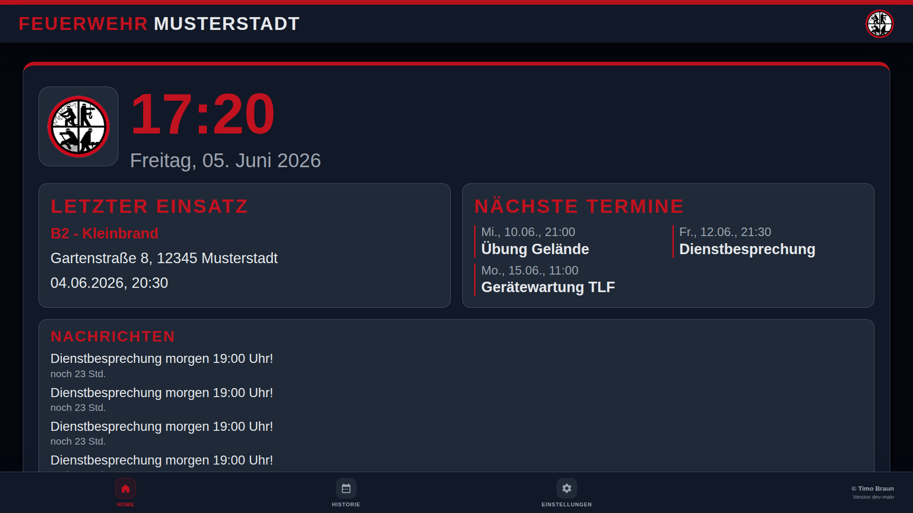

---

### Dashboard – Ruhezustand mit Kalender (Dark)

**Datei**: `docs/screenshots/dashboard-idle-calendar-dark.png`

**Layout**: Standard mit letztem Einsatz links; rechte Seite zeigt **Kalendertermine** (Wechsel-Panel manuell auf Termine gestellt).

**Angezeigte Elemente**:
- Letzter Einsatz links
- Nächste Termine aus konfiguriertem iCal-Kalender rechts
- Uhrzeit, Datum und Wetter im Header

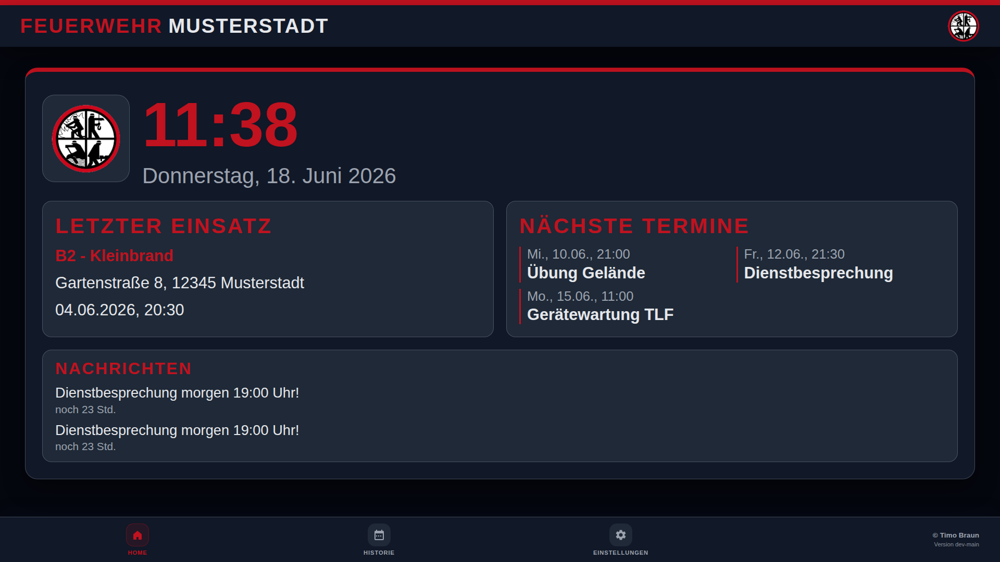

---

### Dashboard – Ruhezustand ohne letzten Einsatz (Dark)

**Datei**: `docs/screenshots/dashboard-idle-no-last-alarm-dark.png`

**Layout**: **„Letzten Einsatz im Ruhezustand anzeigen“** deaktiviert — Unwetterwarnungen dauerhaft links, Kalendertermine rechts (kein automatischer Wechsel).

**Einstellung**: Einstellungen → Ruhezustand → Checkbox deaktivieren, oder `ALARM_MONITOR_SHOW_LAST_ALARM=false`

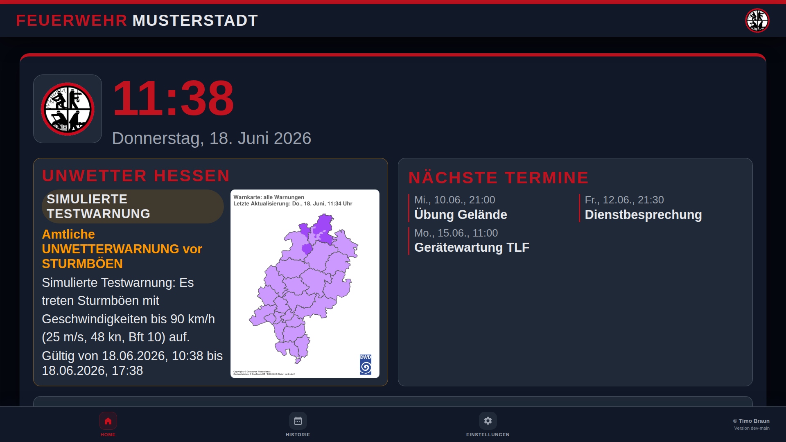

---

## Mobile-Ansichten

### Mobile – Ruhezustand (Dark)

**Datei**: `docs/screenshots/mobile-idle-dark.png`

**Layout**: Standard — letzter Einsatz und Unwetterwarnungen.


---

### Mobile – Ruhezustand ohne letzten Einsatz (Dark)

**Datei**: `docs/screenshots/mobile-idle-no-last-alarm-dark.png`

**Layout**: Alternatives Idle-Layout ohne letzten Einsatz.

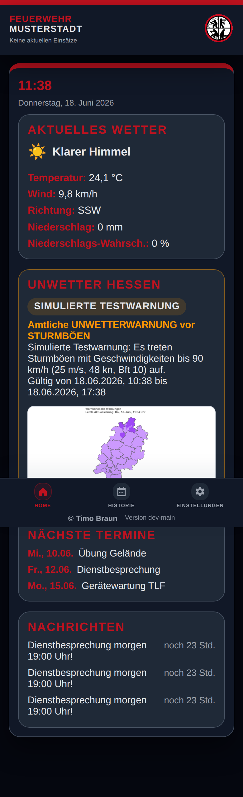

---

### Mobile – Unwetterwarnung (Dark)

**Datei**: `docs/screenshots/mobile-unwetter-dark.png`

**Angezeigte Elemente**:
- Unwetter-Überschrift mit Bundesland
- Warnstufe, Headline und Beschreibung
- Gültigkeitszeitraum und DWD-Warnkarte
- Testmodus-Badge bei simulierter Warnung

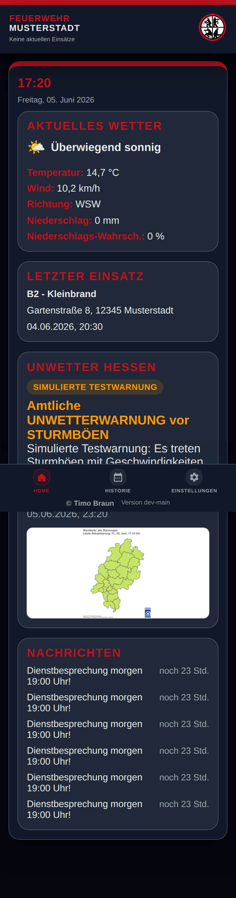

---

### Mobile – Alarmansicht (Light)

**Datei**: `docs/screenshots/mobile-alarm-light.png`

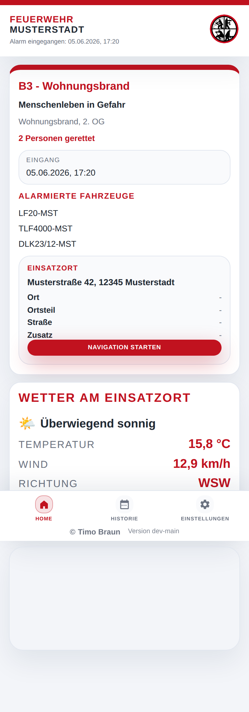

---

## Historie-Ansicht

### Einsatzhistorie (Light / Dark)

| Light | Dark |
|-------|------|
| 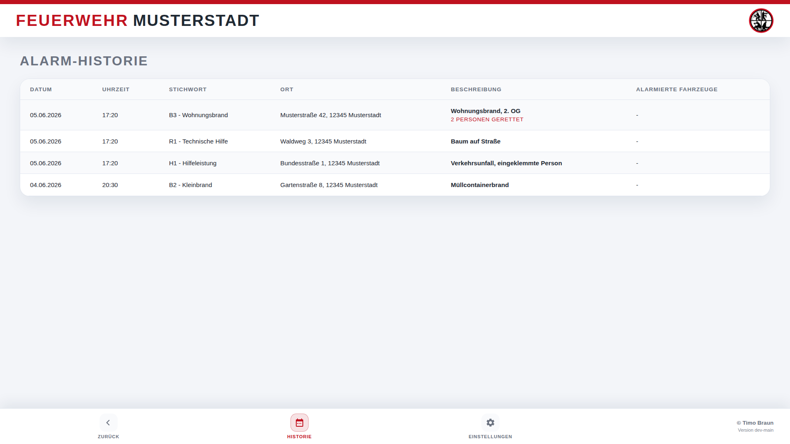 | 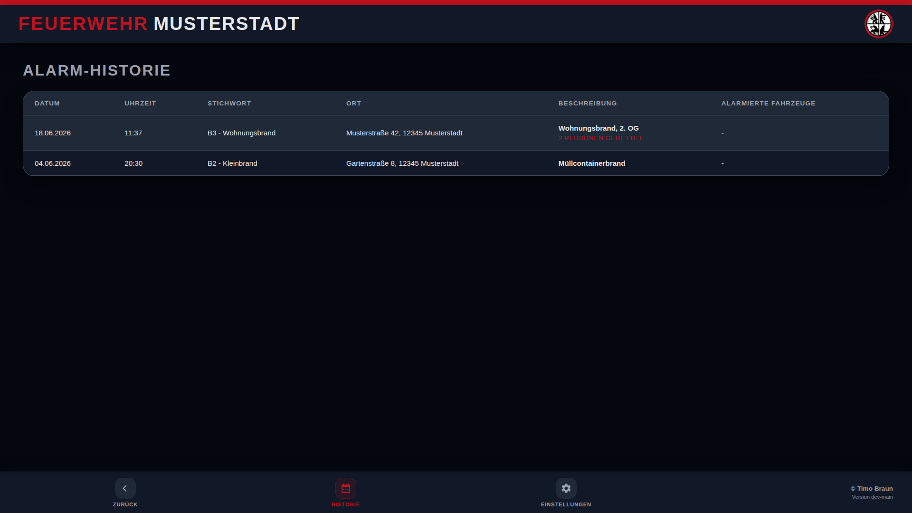 |

---

## Navigations-Ansicht

### Navigation – Routenplanung (Light / Dark)

| Light | Dark |
|-------|------|
| 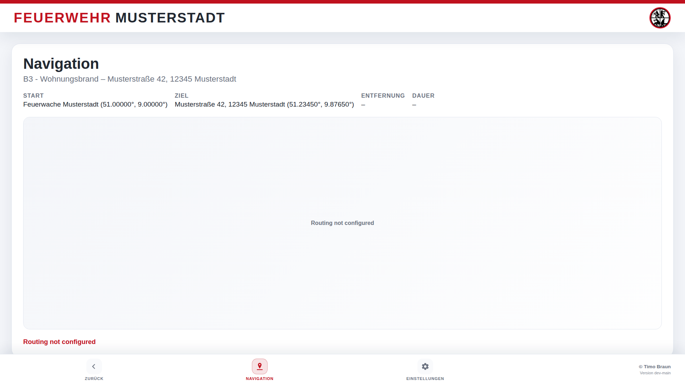 | 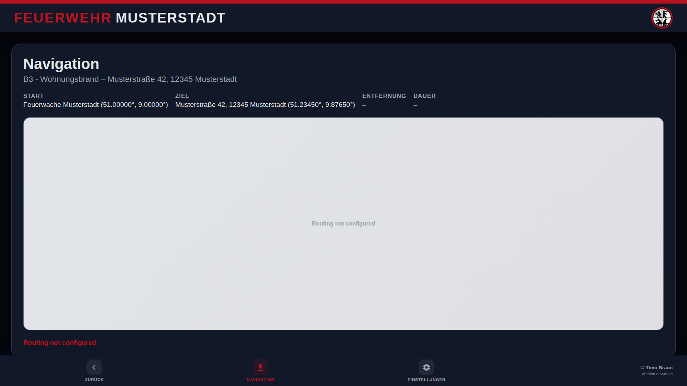 |

---

## Einstellungs-Ansicht

### Einstellungen (Light / Dark)

**Dateien**:
- `docs/screenshots/settings-light.png`
- `docs/screenshots/settings-dark.png`

**Angezeigte Elemente** (vollständige Seite, `full_page`):
- **Allgemein**: Einstellungs-Passwort, Feuerwehr-Name, Gruppen-Filter (TME-Codes)
- **Ruhezustand**: Koordinaten, Standortname, letzter Einsatz, Mindest-Warnstufe (1–4), Unwetter-Simulation, Kalender-URLs
- **Nachrichten (ntfy.sh)**: Topic-URL, Abfrage-Intervall, Nachrichten-TTL
- **Feuerwehr-Logo**: Vorschau und Upload

| Light | Dark |
|-------|------|
|  | 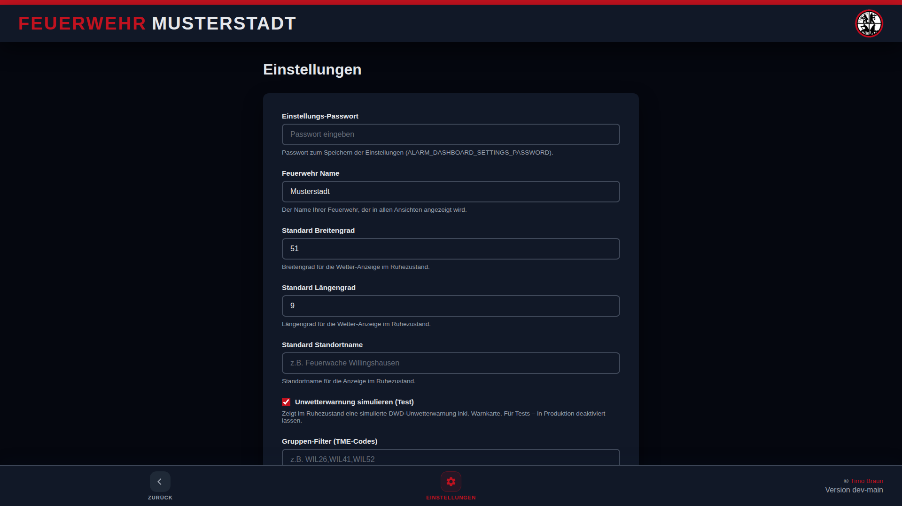 |

---

## Screenshots erstellen

### Automatisch (empfohlen)

```bash
# Aus dem Projektverzeichnis, mit aktivierter venv:
pip install playwright
playwright install chromium
python scripts/capture_screenshots.py
```

Das Skript:
1. Startet einen Testserver mit Beispieldaten
2. Erstellt Alarm-, Verwaltungs- und Einstellungs-Screenshots
3. Startet den Server neu für verschiedene **Idle-Layouts** (`show_last_alarm` an/aus)
4. Speichert alle Dateien in `docs/screenshots/`

### Manuell

1. **App starten** mit Testdaten und Mock-Warnungen:
```bash
ALARM_MONITOR_API_KEY=test-key \
ALARM_MONITOR_SETTINGS_PASSWORD=test-pass \
ALARM_MONITOR_FIRE_DEPARTMENT_NAME=Musterstadt \
ALARM_MONITOR_DEFAULT_LATITUDE=51.0 \
ALARM_MONITOR_DEFAULT_LONGITUDE=9.0 \
ALARM_MONITOR_DWD_WARNINGS_MOCK=true \
python -m flask --app alarm_dashboard.app:create_app run --port 8000
```

2. **Idle-Layouts testen** über `/settings`:
   - Standard: „Letzten Einsatz im Ruhezustand anzeigen“ ✓
   - Alternativ: Checkbox deaktivieren → Unwetter links, Kalender rechts
   - Mindest-Warnstufe: Stufe 1–4 wählbar

3. **Auflösung**: Desktop 1920×1080, Mobile 390×844

4. **Farbmodus**: Light für Alarm/Verwaltung, Dark für Ruhezustand oder `prefers-color-scheme: dark`

### Benennung

Format: `<ansicht>-<light|dark>.png`

Beispiele: `dashboard-idle-no-last-alarm-dark.png`, `settings-light.png`

### Checkliste bei UI-Änderungen

- [ ] `python scripts/capture_screenshots.py` ausgeführt
- [ ] Beispieldaten verwendet (keine echten Einsatzdaten)
- [ ] Alle Idle-Layouts aktualisiert (Standard, Kalender, ohne letzten Einsatz)
- [ ] Einstellungsseite als `full_page` erfasst
- [ ] Referenzen in README.md und diesem Guide angepasst

---

<div align="center">

[⬆ Zurück nach oben](#-screenshot-dokumentation)

</div>
