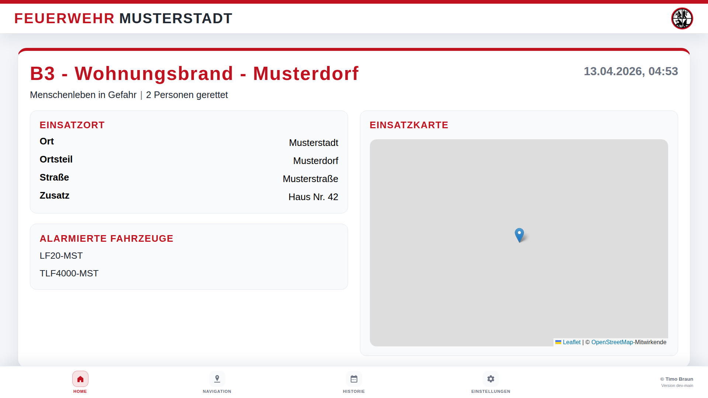
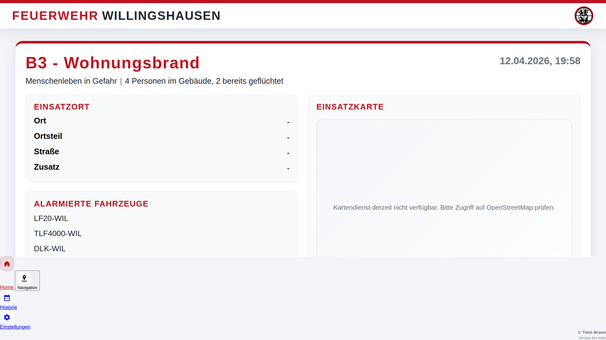
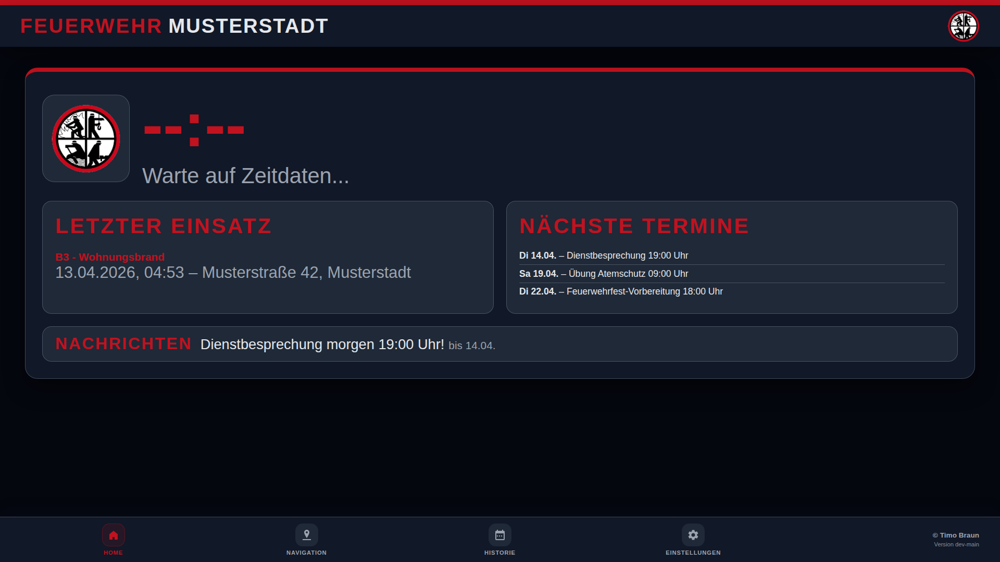
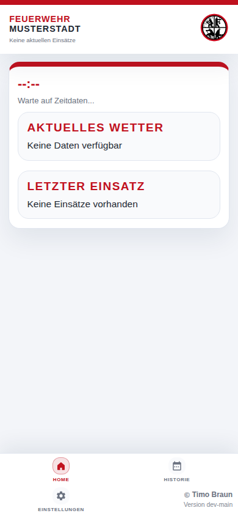
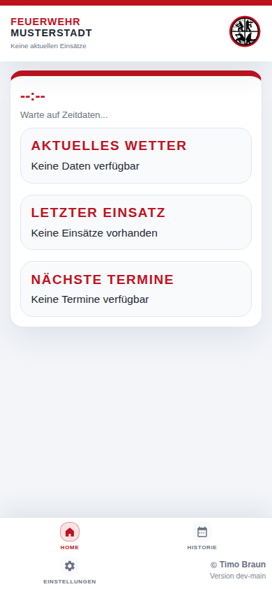
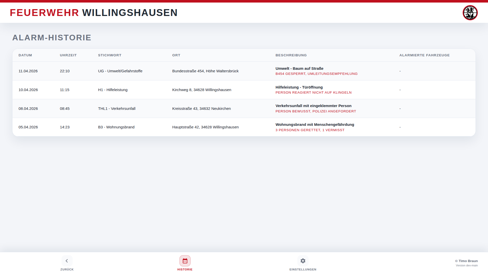
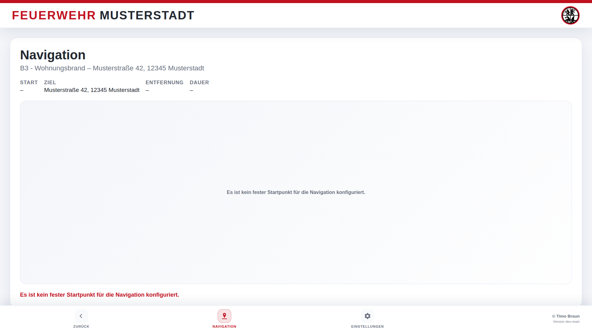
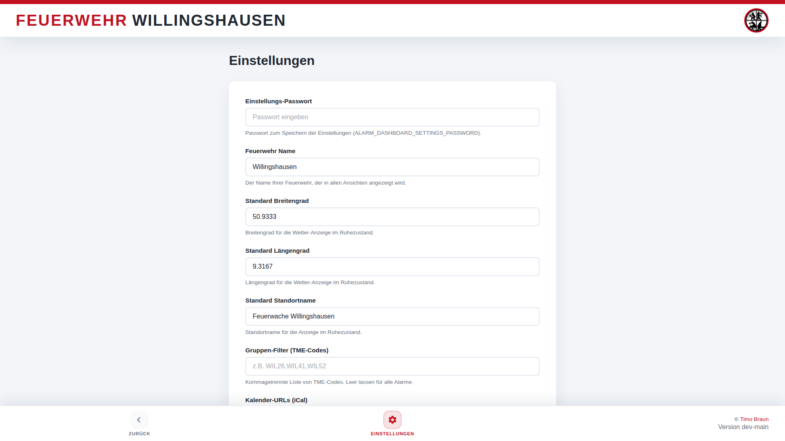

# 📸 Screenshot-Dokumentation

Dieser Guide beschreibt alle Screenshots und Ansichten des Alarm Monitor Systems.
Alle Screenshots wurden in **Full HD (1920×1080)** aufgenommen.

---

## Inhaltsverzeichnis

- [Dashboard-Ansichten](#dashboard-ansichten)
- [Mobile-Ansichten](#mobile-ansichten)
- [Historie-Ansicht](#historie-ansicht)
- [Navigations-Ansicht](#navigations-ansicht)
- [Einstellungs-Ansicht](#einstellungs-ansicht)
- [Admin-Endpunkte](#admin-endpunkte)
- [Screenshots erstellen](#screenshots-erstellen)

---

## Dashboard-Ansichten

### Dashboard – Alarmansicht (Aktiver Einsatz)

**Datei**: `docs/screenshots/dashboard-alarm.png`  
**Auflösung**: 1920×1080 (Full HD)

**Beschreibung**: Vollbild-Ansicht eines aktiven Alarms mit allen relevanten Informationen.

**Angezeigte Elemente**:
- ✅ Alarm-Header mit Stichwort, Unterstichwort und Zeitstempel
- ✅ Diagnose und Bemerkungen (hervorgehoben)
- ✅ Vollständige Adressinformationen (Ort, Ortsteil, Straße, Zusatz)
- ✅ Alarmierte Fahrzeuge (AAO)
- ✅ Interaktive Karte mit Einsatzort-Marker (wenn Koordinaten vorhanden)
- ✅ Wetterdaten am Einsatzort (Temperatur, Niederschlag, Wind)
- ✅ Navigations-Button (öffnet Navigationsseite)
- ✅ Bottom-Navigation (Home, Navigation, Historie, Einstellungen)

**Verwendung**: Hauptanzeige für Alarmdarstellung auf großen Displays



---

### Dashboard – Teilnehmerrückmeldungen (mit alarm-messenger)

**Datei**: `docs/screenshots/dashboard-messenger-feedback.png`  
**Auflösung**: 1920×1080 (Full HD)

**Beschreibung**: Alarmansicht mit zusätzlicher Anzeige von Teilnehmerrückmeldungen vom alarm-messenger (wenn konfiguriert).

**Angezeigte Elemente**:
- ✅ Alle Elemente der Standard-Alarmansicht
- ✅ **Zusätzliches Rückmeldungs-Panel**:
  - Namen der Teilnehmer
  - Zusagen (✓ grün)
  - Absagen (✗ rot)
  - Ausstehende Rückmeldungen (⏳ grau)
  - Qualifikationen (z.B. AGT = Atemschutzgeräteträger, Ma = Maschinist)
  - Führungsrollen (z.B. Zugführer, Gruppenführer)
  - Zusammenfassung (X Zusagen • Y Absagen • Z Ausstehend)

**Voraussetzung**: alarm-messenger muss konfiguriert sein (`ALARM_DASHBOARD_MESSENGER_SERVER_URL`)

**Verwendung**: Einsatzleitung kann sehen, wer verfügbar ist und welche Qualifikationen vorhanden sind



---

### Dashboard – Idle-Ansicht (Ruhezustand)

**Datei**: `docs/screenshots/dashboard-idle.png`  
**Auflösung**: 1920×1080 (Full HD)

**Beschreibung**: Standardansicht wenn kein aktiver Alarm vorliegt oder der letzte Alarm die maximale Anzeigedauer überschritten hat.

**Angezeigte Elemente**:
- ✅ Große digitale Uhr (Stunden:Minuten:Sekunden)
- ✅ Aktuelles Datum (Wochentag, TT.MM.YYYY)
- ✅ Vereinswappen/Logo (individuell anpassbar über Einstellungen)
- ✅ Feuerwehr-Name
- ✅ Lokales Wetter am Standort (wenn Koordinaten konfiguriert):
  - Temperatur, Wetter-Icon, Niederschlagswahrscheinlichkeit
- ✅ **Letzter Einsatz** (kompakte Anzeige mit Zeitstempel und Stichwort)
- ✅ **Nächste Termine** aus iCal-Kalendern (wenn konfiguriert)
- ✅ **Dashboard-Nachrichten** (von ntfy.sh oder API, wenn aktiv)
- ✅ Versions-Anzeige im Footer

**Verwendung**: Permanente Anzeige in der Wache, wenn kein Einsatz aktiv ist



---

## Mobile-Ansichten

### Mobile – Idle-Ansicht

**Datei**: `docs/screenshots/mobile-idle.png`  
**Auflösung**: 390×844 (iPhone 14)

**Beschreibung**: Mobiloptimierte Ansicht für Smartphones und Tablets im Ruhezustand.

**Angezeigte Elemente**:
- ✅ Responsive Header mit Feuerwehr-Name und Wappen
- ✅ Touch-freundliche Bedienelemente
- ✅ Digitale Uhr und Datum
- ✅ Aktuelles Wetter
- ✅ Letzter Einsatz (kompakt)
- ✅ Navigation zur Historie und Einstellungen

**Besonderheiten**:
- Optimiert für Touch-Bedienung (Hochformat)
- Automatische Schriftgrößenanpassung
- Weniger Details als Desktop-Version

**Verwendung**: Zugriff von Smartphones und Tablets, ideal für unterwegs



---

### Mobile – Alarmansicht

**Datei**: `docs/screenshots/mobile-alarm.png`  
**Auflösung**: 390×844 (iPhone 14)

**Beschreibung**: Mobiloptimierte Alarmdarstellung.

**Angezeigte Elemente**:
- ✅ Kompakter Alarm-Header (Stichwort, Unterstichwort, Zeitstempel)
- ✅ Diagnose und Bemerkungen
- ✅ Vollständige Adressinformationen
- ✅ Alarmierte Fahrzeuge (kompakt)
- ✅ **"Navigation starten" Button** (öffnet Apple Karten/Google Maps)
- ✅ Interaktive Karte (wenn Koordinaten vorhanden)
- ✅ Wetterdaten am Einsatzort

**Verwendung**: Schneller Zugriff auf Alarminfos und Navigation von unterwegs



---

## Historie-Ansicht

### Einsatzhistorie

**Datei**: `docs/screenshots/history-alarm.png`  
**Auflösung**: 1920×1080 (Full HD)

**Beschreibung**: Tabellarische Übersicht aller vergangenen Einsätze mit Filterfunktion.

**Angezeigte Elemente**:
- ✅ Such-/Filterfeld (Suche nach Stichwort, Ort, Diagnose)
- ✅ Sortierbare Tabellenspalten:
  - Datum/Uhrzeit
  - Stichwort
  - Ort
  - Diagnose
  - Alarmierte Fahrzeuge
- ✅ Pagination (bei vielen Einträgen)
- ✅ Bottom-Navigation

**Funktionen**:
- Sortierung nach Spalten (Klick auf Spaltenheader)
- Echtzeit-Filterung über Suchfeld
- Responsive Layout für mobile Geräte

**Verwendung**: Nachschlagen vergangener Einsätze, Dokumentation



---

## Navigations-Ansicht

### Navigation – Routenplanung

**Datei**: `docs/screenshots/navigation-page.png`  
**Auflösung**: 1920×1080 (Full HD)

**Beschreibung**: Dedizierte Navigationsseite mit Routenplanung zum Einsatzort.

**Angezeigte Elemente**:
- ✅ Großformatige interaktive Karte (Leaflet/OpenStreetMap)
- ✅ Automatische Übernahme des Einsatzorts aus dem aktiven Alarm
- ✅ Routenplanung (wenn OpenRouteService konfiguriert via `ALARM_DASHBOARD_ORS_API_KEY`):
  - Start- und Zielpunkt markiert
  - Route eingezeichnet
  - Entfernungsangabe (km) und geschätzte Fahrzeit
  - Schritt-für-Schritt-Navigation
- ✅ Links zur externen Navigation (Apple Karten/Google Maps)
- ✅ Bottom-Navigation (Zurück-Button)

**Verwendung**: Detaillierte Routenplanung auf Desktop, z.B. für Einsatzleitung



---

## Einstellungs-Ansicht

### Einstellungen

**Datei**: `docs/screenshots/settings-page.png`  
**Auflösung**: 1920×1080 (Full HD)

**Beschreibung**: Webbasierte Konfigurationsoberfläche für alle wichtigen Einstellungen.

**Konfigurierbare Bereiche**:

**Allgemeine Einstellungen**:
- ✅ Einstellungs-Passwort (Authentifizierung)
- ✅ Feuerwehr-Name
- ✅ Standard-Koordinaten (Breitengrad/Längengrad) für Idle-Wetter
- ✅ Standard-Standortname

**Alarmfilterung**:
- ✅ Gruppen-Filter (TME-Codes, kommagetrennt)

**Kalender-Integration**:
- ✅ Kalender-URLs (iCal, eine URL pro Zeile)

**Nachrichten-Integration (ntfy.sh)**:
- ✅ ntfy Topic-URL
- ✅ ntfy Abfrage-Intervall (Sekunden)
- ✅ Standard-Anzeigedauer für Nachrichten (Minuten)

**Logo-Verwaltung**:
- ✅ Logo-Vorschau (aktuell verwendetes Logo)
- ✅ Neues Logo hochladen (PNG, JPEG, WebP, SVG, max. 2 MB)
- ✅ Standard-Logo wiederherstellen

**Hinweis**: Einstellungen werden sofort übernommen und persistent gespeichert. Das Passwort wird in `ALARM_DASHBOARD_SETTINGS_PASSWORD` konfiguriert.



---

## Admin-Endpunkte

### Health-Check

**Endpoint**: `GET /health`

**Beschreibung**: Minimale JSON-Antwort für Container-Health-Checks.

```json
{"status": "ok"}
```

**Verwendung**: Docker Health-Checks, Monitoring-Systeme, Load-Balancer

---

### Prometheus-Metriken

**Endpoint**: `GET /api/metrics`  
**Authentifizierung**: `X-Metrics-Token: <ALARM_DASHBOARD_METRICS_TOKEN>` Header  
**Aktivierung**: Umgebungsvariable `ALARM_DASHBOARD_METRICS_TOKEN` setzen

**Verfügbare Metriken**:
```
alarm_dashboard_alarms_received_total   # Empfangene Alarme (Counter)
alarm_dashboard_alarms_stored_total     # Gespeicherte Alarme (Counter)
alarm_dashboard_geocode_errors_total    # Geokodierungs-Fehler (Counter)
alarm_dashboard_weather_errors_total    # Wetter-Fehler (Counter)
alarm_dashboard_sse_active_connections  # Aktive SSE-Verbindungen (Gauge)
alarm_dashboard_history_size            # Anzahl Historieneinträge (Gauge)
```

**Verwendung**: Prometheus/Grafana-Integration, Betriebsmonitoring

---

## Screenshots erstellen

### Vorbereitung

1. **App starten** (lokale Entwicklungsumgebung):
```bash
ALARM_DASHBOARD_API_KEY=test-key \
ALARM_DASHBOARD_SETTINGS_PASSWORD=test-pass \
ALARM_DASHBOARD_FIRE_DEPARTMENT_NAME=Musterstadt \
python -m flask --app alarm_dashboard.app:create_app run --port 8000
```

2. **Testdaten einfügen**:
```bash
# Testalarm senden
curl -X POST http://localhost:8000/api/alarm \
  -H "X-API-Key: test-key" \
  -H "Content-Type: application/json" \
  -d '{
    "incident_number": "2026-TEST-001",
    "keyword": "B3 - Wohnungsbrand",
    "keyword_secondary": "Menschenleben in Gefahr",
    "diagnosis": "Wohnungsbrand",
    "remark": "2 Personen gerettet",
    "location": "Musterstraße 42, 12345 Musterstadt",
    "latitude": 51.2345,
    "longitude": 9.8765,
    "groups": ["LF20-MST", "TLF4000-MST"],
    "dispatch_group_codes": ["MST26"]
  }'

# Testnachricht hinzufügen
curl -X POST http://localhost:8000/api/messages \
  -H "X-API-Key: test-key" \
  -H "Content-Type: application/json" \
  -d '{"text": "Dienstbesprechung morgen 19:00 Uhr!", "ttl_minutes": 1440}'
```

3. **Auflösung einstellen**:
   - Desktop: **1920×1080 (Full HD)**
   - Mobile: **390×844 (iPhone 14)** oder ähnlich

### Screenshots automatisch erstellen (Playwright)

```bash
pip install playwright
playwright install chromium

python3 << 'EOF'
import asyncio
from playwright.async_api import async_playwright

async def main():
    async with async_playwright() as p:
        browser = await p.chromium.launch(args=["--no-sandbox"])
        
        # Desktop Full HD
        ctx = await browser.new_context(viewport={"width": 1920, "height": 1080})
        page = await ctx.new_page()
        
        await page.goto("http://localhost:8000/")
        await page.wait_for_timeout(3000)
        await page.screenshot(path="docs/screenshots/dashboard-idle.png")
        
        await ctx.close()
        await browser.close()

asyncio.run(main())
EOF
```

### Nachbearbeitung

- **Sensible Daten**: Echte Adressen und Namen durch Beispieldaten ersetzen
- **Optimieren**: `optipng screenshot.png` oder ImageMagick
- **Dateigröße**: Ziel < 500 KB pro Screenshot

### Speichern und Einbinden

**Speicherort**: `docs/screenshots/`

**In Dokumentation einbinden**:
```markdown

```

---

## Checkliste für neue Screenshots

Bei UI-Änderungen:

- [ ] Screenshots mit Testdaten erstellt (1920×1080 Desktop, 390×844 Mobile)
- [ ] Beispieldaten verwendet (keine echten Einsatzdaten)
- [ ] Bilder optimiert (Dateigröße < 500 KB)
- [ ] In `docs/screenshots/` gespeichert
- [ ] In Dokumentation referenziert:
  - [ ] README.md
  - [ ] SCREENSHOTS.md (dieser Guide)

---

## Aktueller Screenshot-Status

| Datei | Status | Auflösung | Beschreibung |
|-------|--------|-----------|--------------|
| `dashboard-alarm.png` | ✅ Aktuell | 1920×1080 | Dashboard – Alarmansicht |
| `dashboard-idle.png` | ✅ Aktuell | 1920×1080 | Dashboard – Ruhezustand |
| `dashboard-messenger-feedback.png` | ✅ Aktuell | 1920×1080 | Alarmansicht mit Teilnehmerrückmeldungen |
| `history-alarm.png` | ✅ Aktuell | 1920×1080 | Einsatzhistorie |
| `navigation-page.png` | ✅ Aktuell | 1920×1080 | Navigationsseite |
| `settings-page.png` | ✅ Aktuell | 1920×1080 | Einstellungsseite |
| `mobile-idle.png` | ✅ Aktuell | 390×844 | Mobile – Ruhezustand |
| `mobile-alarm.png` | ✅ Aktuell | 390×844 | Mobile – Alarmansicht |

---

## Best Practices

### DOs ✅

- **Anonymisierte Beispieldaten** verwenden
- **Full HD (1920×1080)** für Desktop-Screenshots
- **Vollständige Ansicht** zeigen (kein Zuschneiden)
- **Optimierte Dateigröße** (< 500 KB)

### DON'Ts ❌

- **Keine echten Einsatzdaten** (Datenschutz!)
- **Keine persönlichen Informationen** (echte Namen, Adressen)
- **Keine API-Keys oder Passwörter** sichtbar
- **Keine übermäßig großen Dateien** (> 1 MB)

---

<div align="center">

**Beitragen?**  
Erstellen Sie verbesserte Screenshots und öffnen Sie einen [Pull Request](../CONTRIBUTING.md)!

[⬆ Zurück nach oben](#-screenshot-dokumentation)

</div>
